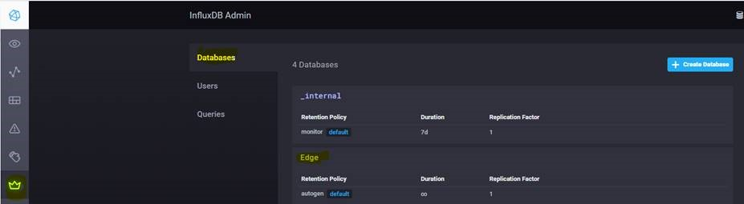
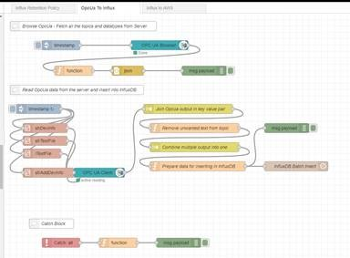
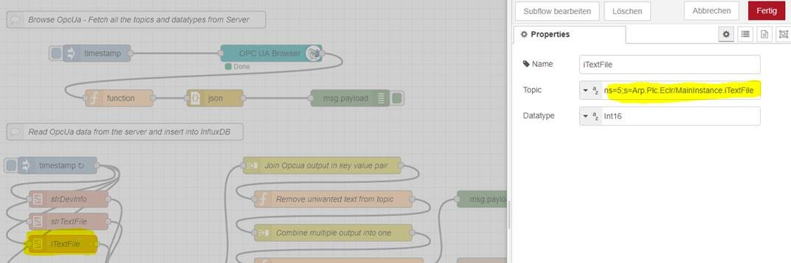
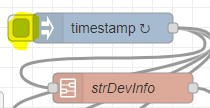

## Quick Reference Guide 
### For
## Phoenix Contact: EPC 1522 and EPC 1502
 
### Version: 1.2
---
# Example Project PLCnext, InfluxDB, Node-RED

SourceCode: [PLCnext Engineer Variables to Node-RED & InfluxDB](SourceCode/Quickstart_Flows/OPCUA/OpcUaToInflux.json) 

This Example Project will show you, how to use all software within the EPC 1502/1522, to import OPC UA variables from PLCnext Engineer to Node-RED, to manage them in InfluxDB.

## PLCnext Engineer

> If you are new to PLCnext Engineer programming, please refer to https://elearning.plcnext.help/PLCnEng_Basics/story_html5.html to develop your PLC programm.

The EPC 1502 and EPC 1522 can be programmed via PLCnext Engineer. Control application can be developed, but also data can be collected through the variety of protocols.
If you want to import your data from PLCnext Engineer to Node-RED and the internal database of your Edge PC, please refer to the following tutorial.

1. Develop a program in PLCnext and mark the data that you want to import in Node-RED and the internal database InfluxDB as "OPC"-variables.

2. Make sure, you selected that eather "All" variables or the "Marked" varibles from Step 1. are configured to be visible.  
  

## Influx-DB

3. Create a new database in InfluxDB.
  

4. Create new user in InfluxDB. Enter a passwort for the user.  
Change the permission to "ALL".
  

## Node-RED

5. Open Node-RED via the Edge-Cockpit
    > Default: 192.168.2.10/cockpit
6.  Import the FLow "OPC UA to Influx" in Node-RED  
The flow can be found here "03_OPCUA_to_Influx".  
  
7. With the help of OPC UAexpert for example, check the name of your OPC UA variables from your PLCnext Engineer Project.  
  
  
8. Copy the name “NodeID” to the function-node  
(The datatype has to be the same than in PLCnext)  
  
9. Configure the OPC UA node:  
Endpoint: opc.tcp://<ip>:4840  
User/Password: (As in PLCnext/WBM – printed on the label of the device)  
  
10. Configure your InfluxDB node (with the settings of step 1 & 2)  
  
11. Deploy your flow  
  
12. Make sure eather your “timestamp” is pressed or is configured in automatic mode (each x seconds).  
  
13.	You should be able to see your data in your database under "Explore" InfluxDB now.  
  
You can import the data into a dashboard and create alerts etc.  