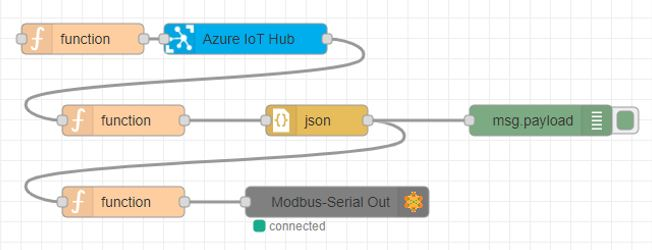
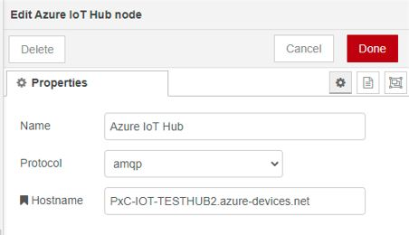
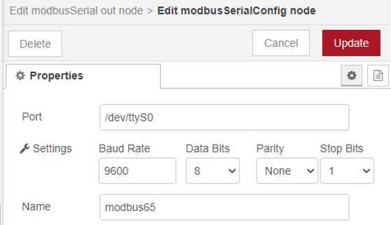
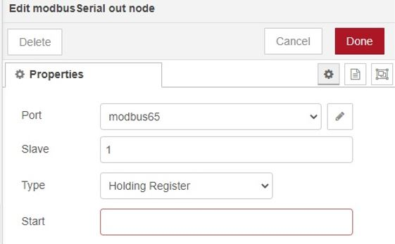

## Quick Reference Guide 
### For
## Phoenix Contact: EPC 1522 and EPC 1502
 
### Version: 1.2
---
# Any-Cloud to Modbus Serial

This flow is used for writing the data into Modbus slave device from cloud (Azure/AWS/GCP). Below flow is used for explaining the said workflow:

## Configuration and Steps
There are three function nodes are used with Modbus serial out node and Azure IOT Hub, for writing values into Modbus slave. 

  
SourceCode: [AnyCloud to Modbus](SourceCode/Quickstart_Flows/QuickGuideFlows/Cloud_to_Modbus.json)  

Configure the Function node for Azure connections:
Enter the device ID, Key, Protocol in Json script for First Function node for connecting with Azure IOT Cloud Interface.

> let data = msg.payload;  
    msg.payload = {  
    deviceId:"<Device ID Here>",  
    key: "<device key here>”,  
    protocol: "amqp",  
    data: data
}  
return msg;

__Configure Azure IOT Hub node__  
- Enter Protocol and Hostname in Azure IOT Hub node  
  
- Output of Azure IOT Hub node is passed to Modbus Serial Out node through respective function and Json nodes.

__Configure the Modbus Serial out node__  

- Enter the Port, Baud Rate, Data Bits, Parity and Stop Bits same as in Modbus Simulator  
  
- Enter the Slaves [Modbus Slave ID], Type [Function Code], Start [Start Address of Modbus Slave from where the data write has to be started], as in Modbus Slave.  
  

[Write data to Modbus Slave](SourceCode/Quickstart_Flows/Modbus/Write_data_to_Modbus_Slave.json)

