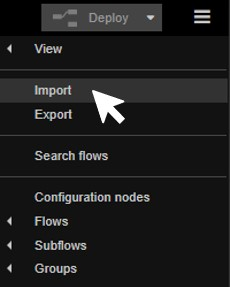
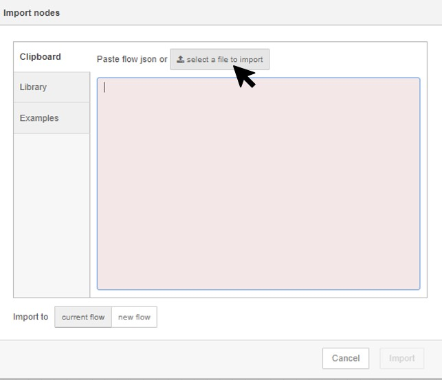

## Quick Reference Guide 
### For
## Phoenix Contact: EPC 1522 and EPC 1502
 
### Version: 1.2
---
# Node-RED Flows Examples & HowTo's

|   #  |  Topic   |  Content   |  SourceCode   |
| --- | --- | --- | --- |
| 0 | [Example Project](00_FirstProjectExample.md) | This Example Project will show you, how to use all software within the EPC 1502/1522, to import OPC UA variables from PLCnext Engineer to Node-RED, to manage them in InfluxDB. | [PLCnext Engineer Variables to Node-RED & InfluxDB](SourceCode/Quickstart_Flows/OPCUA/OpcUaToInflux.json) |
|  1   |  [Basic Flows](01_BasicFlow.md)   |  Learn Node-RED within the Edge PC with basic node functions. Common and function nodes like "Inject","Debug","Switch" nodes are described.    | [Common & Function Nodes](SourceCode/Quickstart_Flows/BasicNodes/Common_Function_Nodes.json)   [Sequence Parser Nodes](SourceCode/Quickstart_Flows/BasicNodes/Sequence_Parser_Nodes.json)   [Storage Nodes](SourceCode/Quickstart_Flows/BasicNodes/Storage_Nodes.json)|
|  2   | [Modbus to InfluxDB](02_ModbusToInfluxDB.md)    | Configure Modbus Serial flows to take values form Modbus Slaves and insert those values into InfluxDB  | [Read data from Modbus Slave](SourceCode/Quickstart_Flows/QuickGuideFlows/Modbus_To_InfluxDB.json)      |
|  3   |  [OPC UA to InfluxDB](03_OPCUA_to_Influx.md)   |  Configure OPC UA flows to take values within PLCnext Engineer (local) and insert those values into InfluxDB  |  [OPC UA to InfluxDB ](SourceCode/Quickstart_Flows/QuickGuideFlows/OpcUa_To_InfluxDB.json) |
|  4   |  [InfluxDB to Any Cloud](04_InfluxDB_to_Cloud.md)  | Injects in every 2 min interval, a function node is provided to trigger multiple InfluxDB measurements at once using node.send   | [InfluxDB to AnyCloud ](SourceCode/Quickstart_Flows/QuickGuideFlows/InfluxDB_To_Cloud.json) |
|  5   |  [Any Cloud to  Modbus Write](05_Cloud_to_ModbusSer)  |  Gathering data from any Cloud and sending them to an Modbus Serial Slave    |  [AnyCloud to Modbus](SourceCode/Quickstart_Flows/QuickGuideFlows/Cloud_to_Modbus.json)   |
|  6   |  [Cloud to OPC UA Write](06_Cloud_to_OPCUA.md)   |  Write data into OPCUA server from cloud (Azure/AWS/GCP)   |  [AnyCloud to OPC UA](SourceCode/Quickstart_Flows/QuickGuideFlows/Cloud_to_OPCUA.json)   |
|     |     |     |     |

## Import Example-flows into Node-RED of your EPC 1502/1522
1. 
 Connect to your Edge-PC via Ethernet and open the Edge-Cockpit.  
    Default: http://192.168.2.10/cockpit 

2. 
 Open Node-RED 

3. Click on the "Import" button on the right upper corner.  
 

4. Click on "select a file to import" and open up the example-flow you downloaded before.  
 
