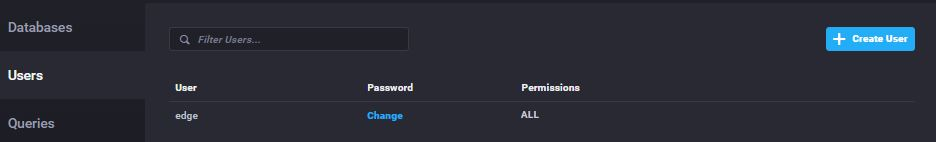
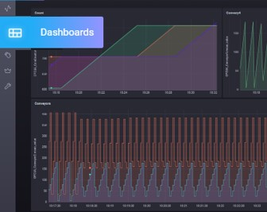
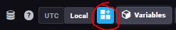
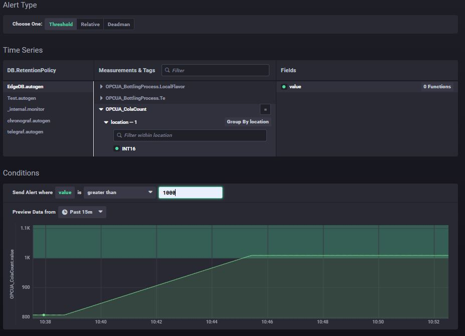
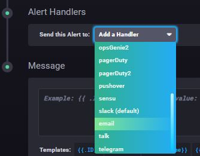
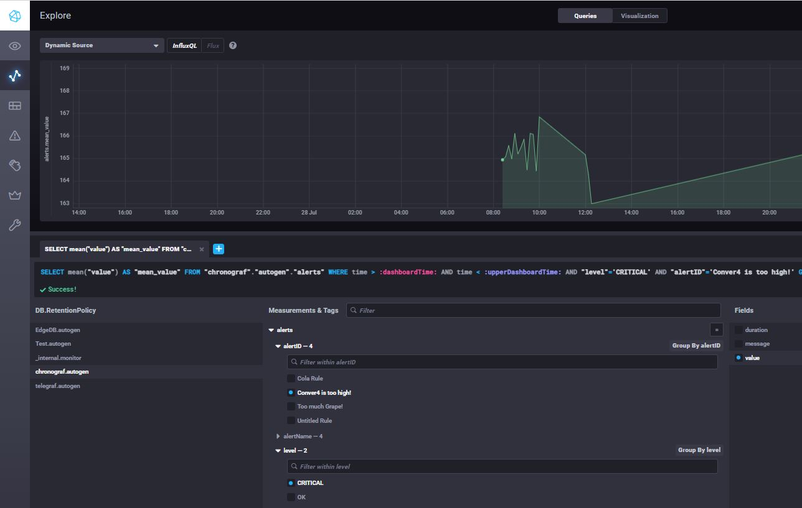

## Quick Reference Guide 
### For
## Phoenix Contact: EPC 1522 and EPC 1502
 
### Version: 1.2
---
# InfluxDB Database configuration

InfluxDB is pre-installed on the Edge-PC 15x2.  
Data can be administrated, processed or saved locally on the device  
Rules can be defined, an alert management can be created.  
With Node-RED we can import data from any device in our network, also data from PLCnext Engineer can be imported.   To understand how to import data from PLCnext or Node-RED to InfluxDB, please follow the steps on this chapter:  
[First Project Example - PLCnext -> Node-RED -> InfluxDB](00_FirstProjectExample.md)

# Create a new database and user
Inside the "InfluxDB Admin" some databases are already set. Those mostly contain system-variables and infromation. Recomended is, to create a new database for variables from the field, so they can be found more easely afterwards.
To do so, click "Create Database" and name your database. Choose a duration, the time how long variables should be stored locally (default unlimited)   

Next, create a new user. Define the username and password and choose the Permission "ALL".  
  
Those information have to be inserted in Node-RED when importing variables. For further infromation, stick to the [First Project Example - PLCnext -> Node-RED -> InfluxDB](00_FirstProjectExample.md).

# Creating a visualisation with dashboards
After importing variables to InfluxDB, your variable should be visible in the "EXPLORE" tab in InfluxDB. You can choose data you want to visualise (multiple selection via the "+") and see it's value over the time in the table.
  
You can also change the visualisation style by clicking the "Visualisation" switch in the top center of the tab.  
  
The generated visualization can now be inserted into a dashboard.  
A dashboard can display multiple bars and diagrams.  
To do so, click on the upper-right buuton "Send to Dashboard" and eather create a new dashboard or send the diagram to a dashboard you already created. The diagram can be named by choosing a "Cell Name".  

## Working with Template Variables 
You can also create a dashboard with a "Template Variable". That way, you can create dynamic bars and diagrams. This means, you can always change what variable should be visualised over the time in diagrams.  
To do so, create a new dashboard in the "DASHBOARD" tab and create a new Template Variable by clicking the upper-right button "+ Add Template Variable"  
  
Chose "Measurement" as Type and select your database, where your variables are stored - in my case "EdgeDB" (Name of my Database). Give your Template Variable a name under "Name" and click "Create".  

Createb new diagrams with different "Visualization" style by adding new cells by clicking the button "Add a new cell to Dashboard" in the upper right corner.  
  
This time you don't choose a specific variable to display on the diagram - You have to work with space-holders. This example query can be used to display variables from your database:
>SELECT mean("value") FROM "NAME_OF_YOUR_DATABASE"."autogen".:NAME_OF_YOUR_TEMPLATE_VARIABLE: WHERE time > :dashboardTime: AND time < :upperDashboardTime: AND "location"='INT16' GROUP BY time(:interval:) FILL(null) 

To understand better, my query is displayed:
  

In the end, you should be able to change the variable of your diagrams by changing the Template Variable in the upper left corner.  
  

# Creating an Alert Management
Open up the tab "ALERTING" -> "Manage Tasks" in InfluxDB.  
Create a new alert rule by clicking the button "+ Build Alert Rule"
Define, what variable should create an alert once it reaches an defined value.   To do so, define the variable under "Time Series" and define the alert condition under "Conditions".  
  
Next, we need to define a handler to the alert. You have a huge variaty on what should happen once the alert is active, for example send an e-mail via SMTP.  
  
 
You can also integrate your alerts into your dashboard-visualisation to display, at what time an alert accures.  
The alerts can be find in the "EXPLORE" tab in the "chronograf.autogen" database.   Next, choose which alert should be visualised and define the "level" to "CRITICAL" so the alert will be displayed. You can then implement the diagram by clicking the button "Send to Dashboard" in the upper-right corner to implement it to your dashbaord.
  

