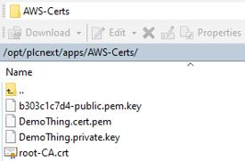
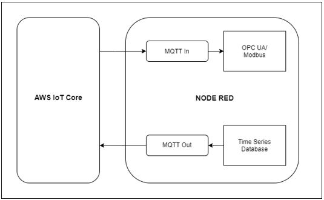
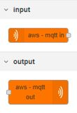
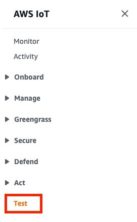
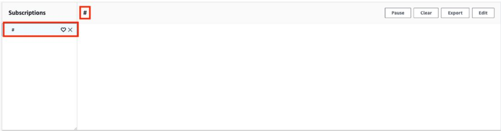

# Getting Started Guide for AWS IoT Core

Before you start this tutorial, make sure that you have completed 
[Getting started with AWS IoT Core](https://docs.aws.amazon.com/iot/latest/developerguide/iot-gs.html) 

## Overview
The Phoenix Contact EPC 1502 and EPC 1522 devices combine the robustness of a proven industrial PC with the openness of the PLCnext Technology ecosystem. The EPCs connect the OT and IT world like no conventional PLC. On one hand, the EPC is a full-featured PLCnext PLC, can collect data through a variety of protocols, and perform automation tasks. On the other hand, pre-installed open source software like Node-RED, the InfluxDB database, and a simple Docker container implementation make building IoT applications easier than ever. 

The EPC product line offers multiple benefits compared to a traditional PLC. This includes integrated additional edge software packages, easy update during operation, over-the-air update without any data loss after a firmware update, qualified and configured open Source packages, and usability and security capabilities with focus on extensibility to program your IoT application! Simple connection to AWS IoT allows data to be collected, stored, and processed.

With AWS, data can be be easily managed in the cloud.

# Hardware Description

## Datasheet
A datasheet can be found on the official Phoenix Contact homepage:  
[Link to EPC 15x2 datasheet](https://www.phoenixcontact.com/online/portal/de/pxc/product_detail_page/!ut/p/z1/5VddU6MwFP0r-tDHNAnffSyUarUq1VoLL0wIocsuECyxVX-9ie2OY0fb2XH6sjAZSODec3PuzWHmwgjOYVSRVb4gIucVKeQ6jKx46k59P9AsfDMxXTQamJ4_Nm5794EGZzCCUcMKRgVLPSLYgi9fYNgfj9UHQRIYmmpWU_oHhgHQMMAGQFi9K_JkSZR1ylL2bpSnMMTYMQ1sqTXPAs-73HUTuSgYDF3-DALvBJz48o5NpMnpX9-HvdtWMPtZbfzRN1cfHfIPpb8dO9qld35m4CuEAxNNXC-YzKY3Xv8awTtFJK8aQSrKFOsv8_GRviWTZiu23BjWS54-UTFgguRFMxKsHH1O3LcF2c1wnWYll8E2sLzJVd0_BZHrKXsW23dfVFFCFKRaPJGFgjnAXGstc9xa5npbmQ9bq_Nha3U-bK3Oh63V-ay1Op-1Vuez9p72tv7hJshoLXNLMg9dGD4ISx-t4YVMQlJ217Tsom79TLvboHH6Ti2uFajsHfPfj49RH0aUV0JtZq4y1EFrlnRQSfKqg7aOTQcVeSPeHeU8GHuVtI8Fo78qXvDFS0x5WfOKVaKJP3h0UGbbGWIJAhqxETAQ1YFj2T1gp5lmmIhpVprIdi7a27FtErK_47tLWTzw42DuDfwDCpna8GGVszW8r_iylF303aYGqoamlemIIh0gkhFgJBYFiZVpQM9sRrCDk57mwHN0IIJu_DDCAXjrqPAXx4V3j5sc1zwq_O1Pd3-x96hPjJ_osi7oHl3W_6rLuiwdfTvA_fx1ypLXz8NB-ofJZsTX1-ZqZ_wHnvGV6I3AmZc4V75uLsp459H0T0_fALRgvXA!/)  
The datasheet is valid for both devices.

## Set up your Development Enviroment

Your EPC 15x2 comes with all the software you need pre-installed.
If you want to use PLCnext Engineer (IEC61131 OT side programming), you have to install PLCnext Engineer on your development-PC (Windows 10 required)
PLCnext Engineer can be installed [here](https://www.phoenixcontact.com/online/portal/de/pxc/product_detail_page/!ut/p/z1/5VfLbuIwFP2VdsHS2HmHJYTQ0lIaSkpJNpFjmygzeTVxoe3Xj10YVaAWNKrYTCIr8ePec32ufSJdGMIlDAu8ThPM07LAmRgHoRn5A991PdVU7mfGAI2HhuNO9Ifeo6fCBQxh2LCMEc6ogzlLyvoNBv3JRC5wHMPAkL2KkN8w8IDSA8gASJFzWRrXWFpTRtmHUUphoCDdRMiW43LlOc7toRtPecZgMC9XfINrdgEuvIkzdZf-hTu9Gk9d90FM_UV5OkpAAh7nt_VH3zx9dMo_EP5WZKu3zvWVrtwhxTPQbOB4s4V_7_SnCM4lpbRoOC4Ik_y_zMxnImsmzNas3hpWdUlfCB8yjtOsGXOWj_dT-O3RHOa6oqu8FMG2sGWTyhuwF0SMffbKd3NfnKeAyHCRvOBEwpxgrraWudJa5lpbmY9aq_NRa3U-aq3OR63V-aK1Ol-0VueL9t72tv7hZkhvLXNTMA8cGDxxUxtv4I1IQpx3NyTvom71Srq7oBH9oBZVElRUkemv5-ewD0NSFlxuZikz1EEbFndQjtOig3aOTQdlacM_HEVflHaRWElqnOdpkUSfO-8gYjDVxnoMVNO0gG6QGGDFouLVM1eYyCVdFHDh0Rptm4LjNd6csmjoRt7SGbonNOFb8Gmdsg18LMo6FxX0fJt1eWpYs6mt9AhQbVUDukUtgNUeBVS1bIXoNrMYhdfoRARN_2GEE_DmWeFvzgs_OG9yBsZZ4R9-uvubo1d9pv9EiVVG9pRY_asSqzy3tV0Dj8t3n8Xv-81G2qfJtkXTqbE-aP-BZ3THe2Nw5cT2nasZSR4dfJr-5eUfJWrRYA!!/)

Node-RED and InfluxDB are pre-installed.
Local processed data will be send into AWS via Node-RED.

## Set up your hardware
Choose the desired mounting method and follow the appropriate 
procedure.

### Wall mount
Order No. [1147655](https://www.phoenixcontact.com/product/1147655)  
The EPC 15x2 can be attached to a flat surface in a wall-mount orientation using the four key holes. The mounting surface must be flat and 
not subject to vibration.
>NOTE:
The EPC 15x2 must be installed with the connectors oriented 
down to allow the convection cooling to function efficiently  

 Installation:
 1.  Attach the two brackets to the EPC... using the included M3x5 
screws.Torque the screws to 0.5 Nm.
2.  Use the EPC 15x2 as a template and mark the locations of the 
mounting holes on the mounting surface.
3. Use the correct anchor type for the mounting surface and securely attach the EPC 15x2 to the wall. Ensure the attaching hardware is in the small section of the mounting holes.  

### DIN rail mount
Order No. [1147464](https://www.phoenixcontact.com/product/1147464)  
1. Install the mounting bracket on the EPC... with the included 
M3x5 screws so the connectors will be oriented downward after 
installation. Torque the screws to 0.5 Nm
2. Angle the EPC 15x2 so the top edge of the mounting plate hangs on 
the top edge of the DIN rail.
3. Rotate the EPC 15x2 down against the lower edge of the DIN rail. 
Press in until the latch snaps closed.
4. Secure the device on the rail with clamps.
5. If necessary to remove, release the latch using a screwdriver, rotate the bottom of the EPC away, and then lift it straight up off 
the DIN rail  

### Connecting the power supply
A removable plug (Order No. [1847055](https://www.phoenixcontact.com/product/1847055) on the EPC 15x2 accepts 
wire sizes of 0.2 ... 2.5 mm² (12 ... 24 AWG).
> NOTE:
To ensure safe operation, use safety extra-low voltage 
(SELV) according to DIN EN 61131 as supply voltage.
This device is protection class I item of equipment.

1. Connect the power conductors to the appropriate terminal in the 
connector.
2. Connect the ground/earth to the screw (5).
3. Insert the connector into the IPC.  

## Setup your AWS account and Permissions
Refer to the instructions at [Set up your AWS Account](https://docs.aws.amazon.com/iot/latest/developerguide/setting-up.html).  Follow the steps outlined in these sections to create your account and a user and get started:
•	Sign up for an AWS account and 
•	Create a user and grant permissions. 
•	Open the AWS IoT console
Pay special attention to the Notes.

## Create Resources in AWS IoT
Refer to the instructions at [Create AWS IoT Resources](https://docs.aws.amazon.com/iot/latest/developerguide/create-iot-resources.html).  Follow the steps outlined in these sections to provision resources for your device:
•	Create an AWS IoT Policy
•	Create a thing object 
Pay special attention to the Notes.

## Provision the Device with credentials
1. Login from your development-PC to your EPC using any SFTP Transfer-Tool. In this exapmle WinSCP was used. WinSCP can be downloaded [here](https://winscp.net/eng/index.php).
2. Create a new folder on your EPC under /opt/plcnext/apps and copy all the certifications downloaded from your AWS Things.  
  

## Demo Application

Following tasks shall be performed for interfacing with Amazon’s AWS cloud:

•	Integrate custom output nodes for AWS-IoT from the open source node repository to provide cloud connectivity with AWS.

•	Create and validate flow to publish telemetry data from Time Series Database to AWS cloud endpoint, using the custom nodes that send data to AWS IoT Subscription.

•	Create and validate flow to write data from Amazon AWS Cloud endpoint to OPCUA server, using the publishing nodes.

•	Create and validate flow to write data from Amazon AWS Cloud endpoint to Modbus RTU Slave, using the publishing nodes.

1. Create a similar flow as shown below:  

2. Edit the aws mqtt nodes for configuration  
Those nodes will be pre-installed on your Node-RED of your EPC 15x2.  

3. Click on edit icon against Device  

4. Enter Name for the node, type as MQTT broker, AWS Thing name as Client ID, Device Advisor Endpoint as Endpoint, and location where the certificates have been copied.  

5. Navigate back to [AWS Console](https://console.aws.amazon.com/iot/home), in the left menu, choose Test.  

6. Subscribe to a topicName on which your device publishes. For the getting started sample app, subscribe to #, which subscribes to all message topics.  
Continuing with the getting started example, on the Subscribe to a topic tab, in the Topic filter field, enter #, and then choose Subscribe.  

7. The topic message log page, # opens and # appears in the Subscriptions list.  

If the device that you configured in Configure your device is running the example program, you should see the messages it sends to AWS IoT in the # message log. The message log entries will appear below the Publish section when messages with the subscribed topic are received by AWS IoT.  
On the # message log page, you can also publish messages to a topic, but you'll need to specify the topic name. You cannot publish to the # topic.  
Messages published to subscribed topics appear in the message log as they are received, with the most recent message first.

## Troubleshooting
The following information might help you troubleshoot common issues in AWS IoT:
[Link to Troubleshooting AWS IoT](https://docs.aws.amazon.com/iot/latest/developerguide/iot_troubleshooting.html).

Also, feel free to ask your question in our [PLCnext Forum](https://www.plcnext-community.net/en/discussions-2-offcanvas/forums.html).