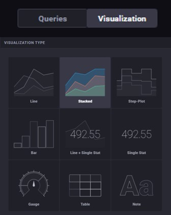
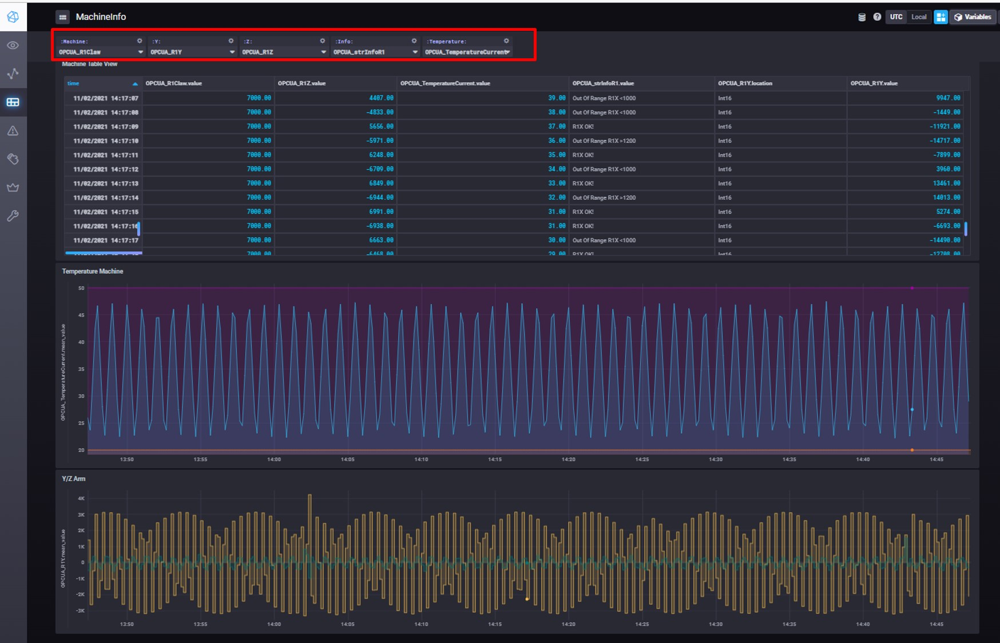
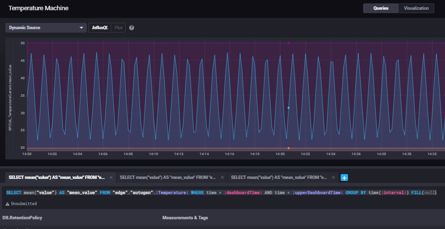

# Create a new database and user
Inside the "InfluxDB Admin" some databases are already set. Those mostly contain system-variables and infromation. Recomended is, to create a new database for variables from the field, so they can be found more easely afterwards.
To do so, click "Create Database" and name your database. Choose a duration, the time how long variables should be stored locally (default unlimited)   

Next, create a new user. Define the username and password and choose the Permission "ALL".  
  
Those information have to be inserted in Node-RED when importing variables. For further infromation, stick to the [First Project Example - PLCnext -> Node-RED -> InfluxDB](00_FirstProjectExample.md).

# Creating a visualisation with dashboards
After importing variables to InfluxDB, your variable should be visible in the "EXPLORE" tab in InfluxDB. You can choose data you want to visualise (multiple selection via the "+") and see it's value over the time in the table.
  
You can also change the visualisation style by clicking the "Visualisation" switch in the top center of the tab.  
  
The generated visualization can now be inserted into a dashboard.  
A dashboard can display multiple bars and diagrams.  
To do so, click on the upper-right buuton "Send to Dashboard" and eather create a new dashboard or send the diagram to a dashboard you already created. The diagram can be named by choosing a "Cell Name".  

## Working with Template Variables 
You can also create a dashboard with a "Template Variable". That way, you can create dynamic bars and diagrams. This means, you can always change what variable should be visualised over the time in diagrams.  
To do so, create a new dashboard in the "DASHBOARD" tab and create a new Template Variable by clicking the upper-right button "+ Add Template Variable"  
  
Chose "Measurement" as Type and select your database, where your variables are stored - in my case "EdgeDB" (Name of my Database). Give your Template Variable a name under "Name" and click "Create".  

Createb new diagrams with different "Visualization" style by adding new cells by clicking the button "Add a new cell to Dashboard" in the upper right corner.  
  
This time you don't choose a specific variable to display on the diagram - You have to work with space-holders. This example query can be used to display variables from your database:
>SELECT mean("value") FROM "NAME_OF_YOUR_DATABASE"."autogen".:NAME_OF_YOUR_TEMPLATE_VARIABLE: WHERE time > :dashboardTime: AND time < :upperDashboardTime: AND "location"='INT16' GROUP BY time(:interval:) FILL(null) 

To understand better, my query is displayed:
  

In the end, you should be able to change the variable of your diagrams by changing the Template Variable in the upper left corner.  
  

# Example - Use-Case for Template Variables
In this example, data is collected from a machine and then being visualised via multiple Template Variables to be able to visualise different variables in one table.  
  

### Configuration
Create a new dashboard and a the number of Template Variables you require.  

### TABLE
To cofigure a table with your tempate variables, create a new cell, defince the "Visualization" as "Table".  
Enter the following Query:
>SELECT * FROM "Name_of_your_database"."autogen".:Name_of_your_TempVar:  

Add another tab for each template variable.  

  

Unwanted cells in your table can be configured as "hidden".  

  

### Graph

To create a graph using numerous Template variables  

> SELECT mean("value") AS "mean_value" FROM "Name_of_your_database"."autogen".:Name_of_your_TempVar: WHERE time > :dashboardTime: AND time < :upperDashboardTime: GROUP BY time(:interval:) FILL(null) 

 
