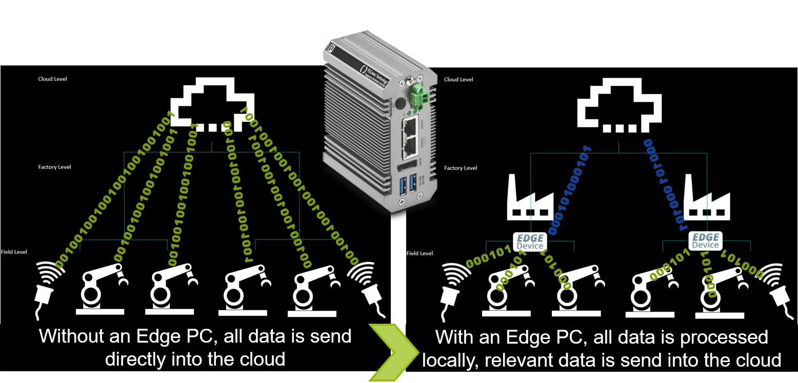
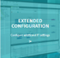
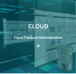

## Quick Reference Guide 
### For
## Phoenix Contact: EPC 1522 and EPC 1502
 
### Version: 1.2
---
# Edge PC EPC15x2 Introduction 
# Functions & Features of the Edge Cockpit

## What is Edge Computing?
An Edge PC processes data closer to where it is generated, instead of processing it in the Cloud - with great benefits in Latency, bandwith of your network and secruity!
>Edge Computing is the practice of capturing, storing, processing and analyzing data near the client, where the data is generated.  

The Edge PCs of Phoenix Contact are the perfect tools for your IoT development.
>To the products:  
https://www.phoenixcontact.com/product/1185416   EPC 1502 
https://www.phoenixcontact.com/product/1185423   EPC 1522

The EPC combines the functionality of a traditional PLC (programable via PLCnext Engineer) with all featured protocals like Profinet, OPC UA, Modbus,...  
and the functionality of an IoT device.  
Software like Node-RED or Influx-DB are pre-installed with easy integration.
With Docker-Portainer unlimited use-cases can be served.

# Starting the Edge Cockpit

To start any function on the EPC, make sure your Host-PC is connected via Ethernet and configured in the same network.
Open up a webbrowser (e.g. Google Chrome) and open-up the Edge-Cockpit:
<b>ip-adress/cockpit </b>
(default X2-Ip adress: 192.168.2.10/cockpit)

>From here you can start any Function like Node-RED, Docker-Portainer or the InfluxDB Databaseadministration.

## Functions of the Edge Cockpit

|   #  |  Topic   |  Content  |  
| --- | --------- |  --------- |
|  |  PLCnext WBM | Web Based Management for PLCnext   Firmware Update / User configuration / Firewall / LDAP   PLCnext Store administration / PROFICLOUD administration  | 
|  |  Extended Configuration IoT | Network Configuration / Date & Time for Database   Node-RED Configuration / USB enable or disable   Reboot  |
|  | Node-RED | Start Node-RED to programm a flow-based IoT program  Further information and example flows can be found here:   [Node-RED Example-Flows](07_Node-RED_HowTo.md) |
|  | InfluxDB Database | Start InfluxDB Database   Save and administrate data, create rules how to handle data or events   Further information can be found here:   [InfluxDB Database](09_InfluxDB.md)|
|  | Docker-Portainer | Start Docker-Portainer to administrate and add containers   Further information and how to install Docker-Portainer form the PLCnext Store can be found here:   [Docker-Portainer Installation](08_DockerPortainer.md)|
|  | Cloud-Connection | The EPC 15x2 offers a variety of cloud connections   Quickink to AWS Console, Microsoft Azure and Google Cloud Platform |
|  | Visualisation |Quicklink to PLCnext Engineer Visualisation|