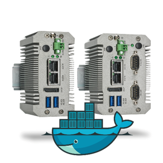
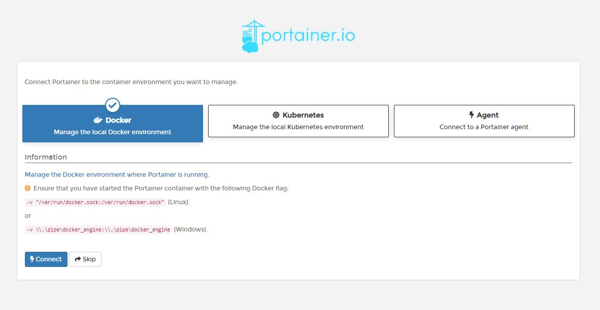

## Quick Reference Guide 
### For
## Phoenix Contact: EPC 1522 and EPC 1502
 
### Version: 1.2
---
# Installation of Docker-Portainer

Docker simplifies application deployment with containers, which contain all
the necessary packages, that can be easily transported and installed as files.
Containers ensure the separation and management of resources used on the
EPC.
This includes: code, runtime module, system tools, system libraries.
Portainer removes the complexity associated with container orchestrators so
anyone can exploit the power of containers. It can be used to set up
environments, deploy applications and monitor application performance.  
  
 
## How to install Docker-Portainer on my EPC?

>Important! If you updatet your EPC to FW 2022.0, please re-install the new version of Docker-Portainer from the PLCnext Store.

1. Visit the PLCnext Store https://www.plcnextstore.com/977  
and log in to your PLCnext Store account. If you haven't already, you need to register

2. Register your EPC 15x2 with you UUID in the PLCnext Store.
3. Make sure your EPC 15x2 is connected to the internet and is marked as
“online” in your device-list.
4. Install the app via the Internet.
5. Make sure, the app is running: “RUN” as Status.
6. On the first login you must create a new user account:
Set up a password.
> If you are required to log in at first start, the default user is:  
User:     admin  
Passwort: admin123  

7. Choose Docker to use Docker-Portainer after the setup.

## Troubleshooting

If the App can’t be installed or if an error message appears,
it is possible that the contents of the user file system must be deleted.
(See also “Type 1 Reset”:
File System - The PLCnext Runtime (plcnext-runtime.com))
A type 1 reset deletes the entire contents of the user file system on the
primary storage device. The contents of the firmware file system remain
unaffected.
To perform a type 1 reset, open a secure shell session on the PLC, and issue
the following command:

> sudo recover-plcnext 1

> Attention! This will delete all user content as well as any Node-RED or InlfuxDB program! - Make sure you exported all needed files.

1. Log in via Putty to your EPC with Admin credentials
2. Delete the the contents of the user file system  
  
3. Restart your device and try to install the app again.

# How to deploy a container - Example

## Installation of IOBroker in Docker-Portainer
Please follow the steps in the "MAKERS BLOG" in the PLCnext Forum: 
https://www.plcnext-community.net/en/hn-makers-blog/623-iobroker-on-plcnext-device-e-g-epc-1522.html

