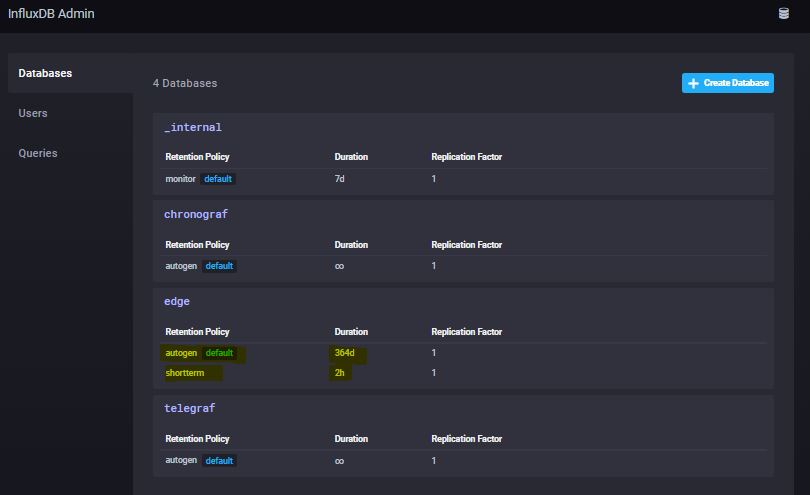
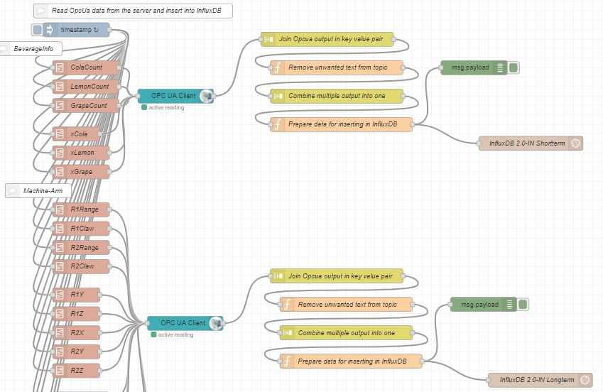
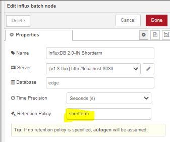

# Downsampling Data with InfluxDB Chronograf

InfluxDB can handle hundreds of thousands of data points per second. Working with that much data over a long period of time can create storage concerns. A natural solution is to downsample the data; keep the high precision raw data for only a limited time, and store the lower precision, summarized data longer. 

## Configure your Retention Policy
In my example, I created two policies:  
autogen - for important data to safe for 1 year.  
shortterm - for unimportant data that I just want to buffer for 2 hours locally and downsample.  

  

## Write data into into each Retention Policy
The Retention Policy has to be configured in your Node-RED InfluxDB node. 
Decide, which data should be stored for just a short time and what data should be safed for much longer on the EPC.  

  

Here is an example of the configuration of my Node-RED Influx-IN Node for the shortterm-storage:  

  

To downsample the shortterm data in InfluxDB, switch to the tab "Alerting"  --> "Manage Tasks"  

Create a new TICKscript by clicking the "Create TICKscript" button.  

  

> batch  
    |query('SELECT mean("value") AS "mean_value" FROM "Name_of_your_database"."Name_of_your_shortterm_RP"."Name_of_your_variable"')  
        .period(1m)  
        .every(1m)  
        .groupBy(*)  
    |influxDBOut()  
        .database('Name_of_your_database')  
        .retentionPolicy('Name_of_your_longterm_RetentionPolixy')  
        .measurement('Cola_Sample_1min')  
        .precision('s')  

With the script above, your value of your variable will be copied to the new measurement each minute. 
The shortterm data will be lost after 2 hours, but since we copied the value into the new measurement inside our longterm Retention Policy, the data will be stored for much longer, but won't require too much space inside our storage.  

In this screenshot, you can see, the "shorttime" data that is only valid for 2 hours but much more presicely. Since I do not need to store the value each Second, the downsampled data is better to store for a longer time.  
  
    
