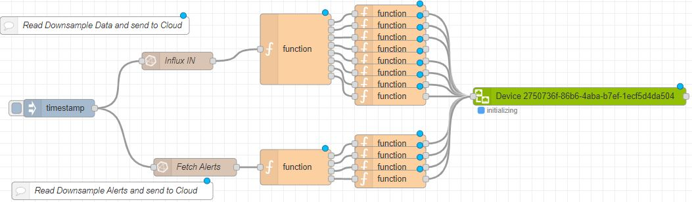
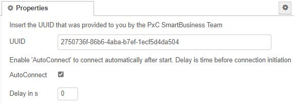

# Quick Reference Guide 

## Send data into Proficloud
 

> **SourceCode can be found [here](../Node-RED/InfluxToProficloud.json)**

>To learn about the Proficloud.io from Phoenix Contact, please visit:  
https://proficloud.io/e-learning/ 
   
Especially start the courses:  
[Node-RED and Proficloud.io](https://proficloud.io/e-learning/get-to-know-node-red-and-proficloud-io/)  
and  
[Connect the Machine Manager to Proficloud.io](https://proficloud.io/e-learning/connect-the-machine-manager-to-proficloud-io/)

To follow on directly from the last point of the course "Connect the Machine Manager" this section will describe in more detail how to read out the internal InfluxDB database and send the data to the Proficloud.  

Once you created a virtual device in Proficloud.io, import the attached SourceCode in Node-RED to read data from your InfluxDB bucket and send those data into Proficloud.  

  

The "InfluxDB IN" node will be used to read data from the internal InfluxDB database. Configure the organisation, and set the admin token as described in the [InfluxDB Configuration](../Influx2/Influx_Configuration.md).  
Inside the Query, the path to the data must be set.  
Set the bucket-name, the retention-policy and the name of your data.  

  

The function nodes have to configured to massage the data to a data format that Proficloud.io can work with.  

In the Proficloud node, you only have to set the UUID you generated before in Proficloud.io  

  

Once deployed, your Proficloud-Node should change its status from "connecting" to "connected".   
If a error occurs, please check that your EPC has an internet connection.  

If everything was configured correct, switch to Proficloud.io and assign your metrics.   Each variable send to the cloud has to assigned to a metric to be able to log those inside the Time Series Data Base of the Prodicloud.io.  
  

Assign each variable you want to work on to a metric.  

>For small scale application with up to 20 metrics (variables), the Proficloud.io is completely free of charge!  

  

Switch to the "Time Series Data Service" and create a Dashboard with the data you just assigned to a metric.
  
  