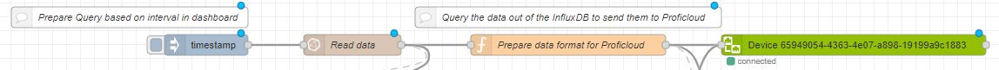
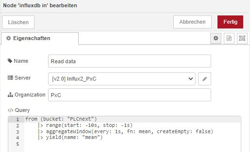
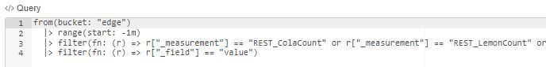
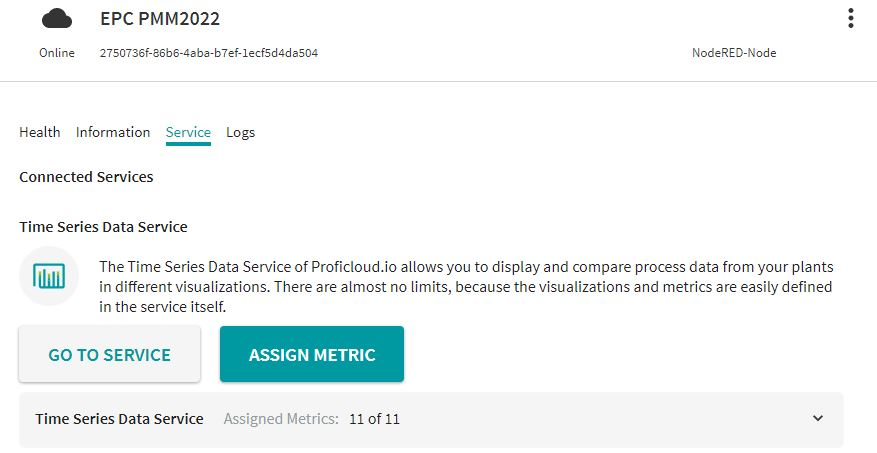
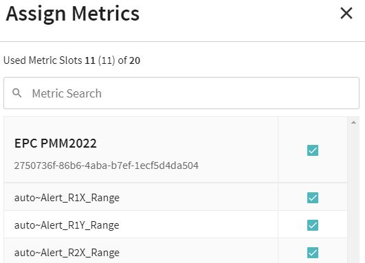
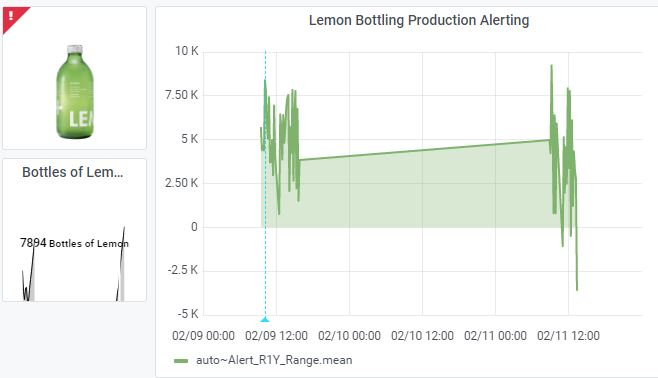
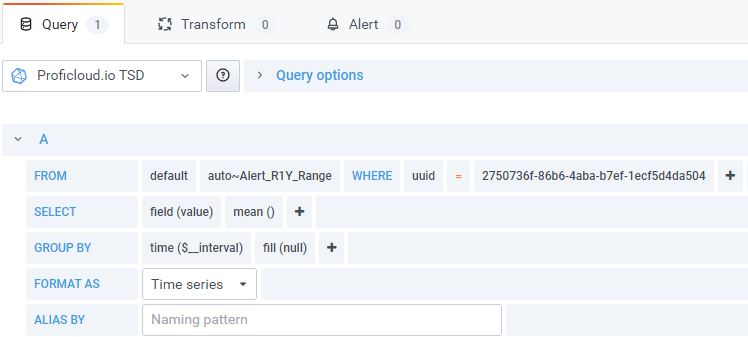

# Quick Reference Guide 

## Send data into Proficloud
 

> **SourceCode can be found [here](../Node-RED/InfluxToProficloud.json)**

>To learn about the Proficloud.io from Phoenix Contact, please visit:  
https://proficloud.io/e-learning/ 
   
Especially start the courses:  
[Node-RED and Proficloud.io](https://proficloud.io/e-learning/get-to-know-node-red-and-proficloud-io/)  
and  
[Connect the Machine Manager to Proficloud.io](https://proficloud.io/e-learning/connect-the-machine-manager-to-proficloud-io/)

1. Inside the Proficloud.io, create a new "Virtual Device" to create a new UUID.   This process is also descibed in the above links.  
2. Import the [JSON SourceCode](../Node-RED/InfluxToProficloud.json) in Node-RED.  
  
3. Set the vitual UUID you just created inside the "ProficloudDevice" Node.  
4. Configure the InfluxDB "Read data" node.  
In my example, all data inside the bucket "PLCnext" will be read.  
The data of the last 10 seconds "(start: -10s, stop: -1s)" are summarized in a sampling rate of 1s "every 1s, fn: mean".  
Change the settings according to your application.  
  
 
If you want to only read some data out of a single InfluxDB bucket, you can do so by setting filters inside the query.  
  

5. Read the data from InfluxDB and write data into Proficloud.io using the inject node "timestamp".

If everything was configured correct, switch to Proficloud.io and assign your metrics.   Each variable send to the cloud has to be assigned to a metric to be able to log those inside the Time Series Database of the Prodicloud.io.  
  

Assign each variable you want to work on to a metric.  

>For small-scale application with up to 20 metrics (variables), the Proficloud.io is completely free of charge!  

  

Switch to the "Time Series Data Service" and create a Dashboard with the data you just assigned to a metric.
  
  