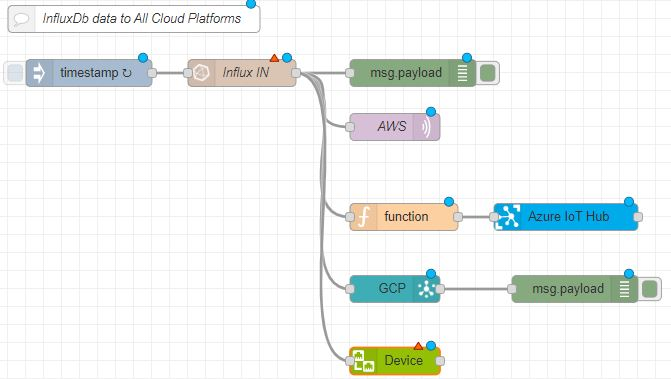

# Quick Reference Guide 

## Send data into AnyCloud
 

> **SourceCode can be found [here](../Node-RED/InfluxDB2_to_Cloud.json)**

To be able to send any data from the internal InfluxDB database, import the SourceCode attached above.  

  

The "InfluxDB IN" node will be used to read data from the internal InfluxDB database. Configure the organisation, and set the admin token as descibed in the [InfluxDB Configuration]().  
Inside the Query, the path to the data must be set.  
Set the bucket-name, the retention-policy and the name of your data.  

  

For a more detailed explanation, see also:  
[Configure and send data into Proficloud](InfluxDB_to_Proficloud.md)  
[Configure and send data into AWS](../../../10_AWS_QuickstartGuide.md)  
[Configure and send data into MS Azure](../../../11_Azure_QuickstartGuide.md)  