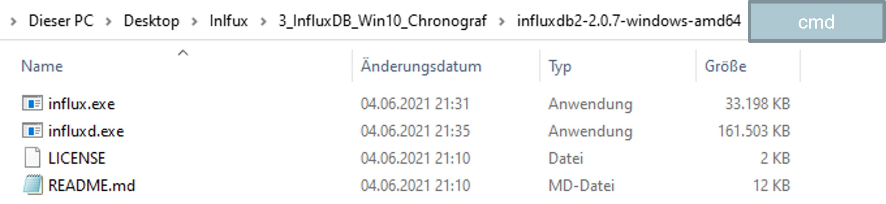
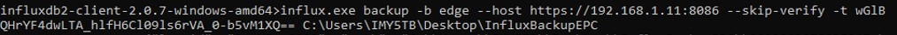
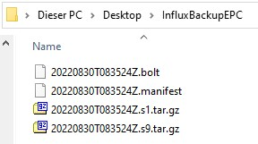
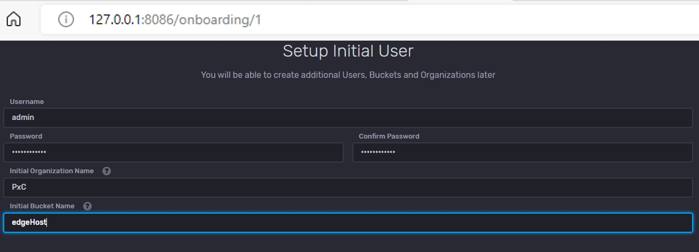
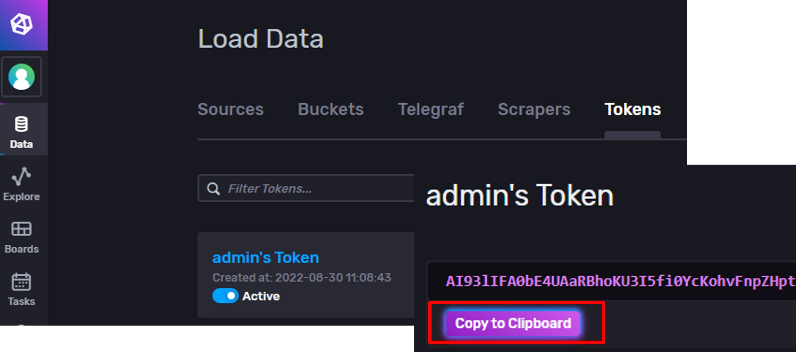
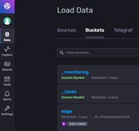
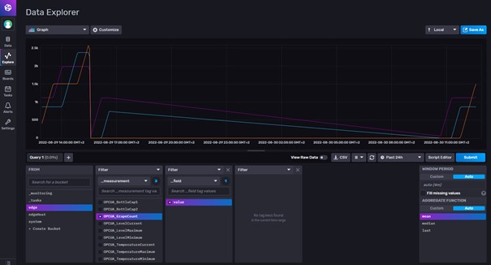

# Quick Reference Guide 

## InfluxDB 2.0 Backup & Restore database to Host-PC

In order to be able to analyze data of your machine over a period of months, it can be useful to create a "backup" and to be able to save and view it on the Windows host PC as well "restore".

With this tutorial, you'll save a bucket filled with data, store it on your local host PC and visualize this data in InfluxDB on your host PC.

1. Download the InfluxDB CLI Tool and InfluxDB Runtime via [this link](https://dl.influxdata.com/influxdb/releases/influxdb2-2.0.7-windows-amd64.zip) from Influx data.
> Attention, linked is version 2.0.7 which is required. A newer version might not work.

2. Once downloaded, unzip the file and save the contant to a local folder on your Host-PC.  
  

3. Open up a Comand-promt (CMD). You can do so by entering "cmd" in the folder.  
The EPC with the data we want to backup and transfer to our Host-PC must be connected.   The influx cli tool can transfer all files, or as in this example only one bucket. In order to access the EPC, the admin-token needs to be copied from the EPC.  
Write the command:  

        influx.exe backup -b [name of bucket] --host https://[ip-adress-of-epc]:8086 --skip-verify -t [admin-token-from-epc] [target-directory-of-host-pc] 

    With my IP address and my admin token (under Data --> Token), the command looks like this:  
      

4. A backup should now be created any copied to your target directory of your Host-PC.  
  

5. Since the data is now on the host PC, we need to start the InfluxDB runtime to be able to view it.  
To do so, go back to the previously downloaded and unzipped folder and start a new CMD console.  
  

6. Start the InfluxDB Runtime and Crhonograf on your Host-PC using this command:  

        influxd.exe

         

7. InfluxDB was started and now listen to port :8086 of your Host-PC.  
Start up any internet-browser and connect to the url: https://127.0.0.1:8086  
A setup will occur when first starting InfluxDB. Set a user and password.  
     

8. Once finished, we now want to restore the data from the EPC.  
First, go to "Data" --> "Tokens" and copy the value of the "admin's Token".  
     

9. In order to restore the data copied from the EPC into the InfluxDB of your Host-PC, we need to open up another CMD prompt from the downloaded and unziped folder before.  
  

    Write the command:  

        influx.exe restore [target-file-where-the-data-was-copied (Step4)] -t [Admin-Token-from-Host-PC (Step8)] --skip-verify

    With my credentials, it looks like this:  
      

10. The Bucket from the EPC with all the data should now also be visible on your Host-PC. A new bucket (in my case: "edge") will be created.  
Refresh your InfluxDB Chronograf (https://127.0.0.1:8086) and find the new bucket under "Data" --> "Buckets".  
  

Inside that bucket, all data from the EPC can be found and analysed as well as stored inside the Host-PC.  

  
