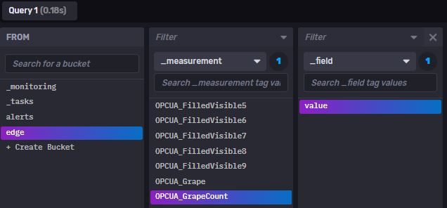
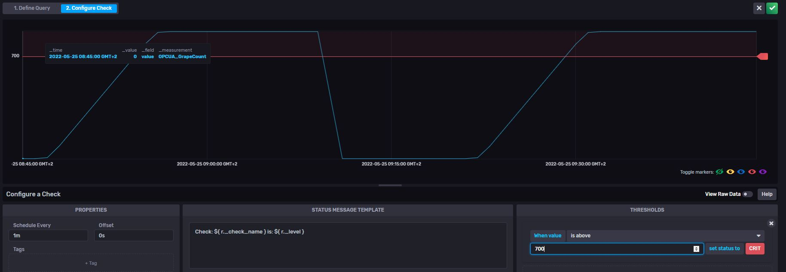
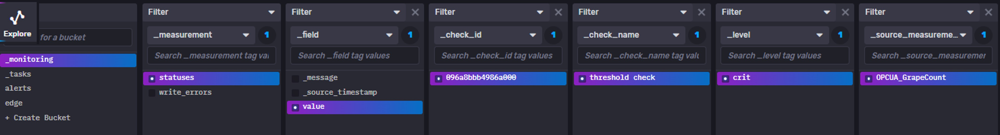

# Quick Reference Guide 

## Create an Alert Management with InfluxDB

If you want your EPC to check the current data which was collected from the field, go to the "Alerts" tab in InfluxDB Chronograf.  

You can set up an "Threshold Check" that will alert whenever a value of a variable is outside a configured range.  
The "Deadman Check" can be used to check a service that won't send any data anymore.  

In this chapter, a "Threshold  Check" was created.  
If you want to create a threshold check, you must configure a field, a function and a threshold.  

First, define what data should be checked from your bucket and submit the data.  
  

Next, define the threshold in the second tab "2. Configure Check".  
  

You can configure the error message, more information can be found [here](https://docs.influxdata.com/influxdb/v2.0/monitor-alert/checks/)  

Once configured, your alerts can now be seen in the "Explore" tab and can be included into your Dashboard visualisation.  

  

You can also send the alert via e-mail directly from InfluxDB, please refer to [here](https://docs.influxdata.com/influxdb/v2.0/monitor-alert/send-email/)

Please see next chapter: [Configure Telegraf](Telegraf_Configuration.md)