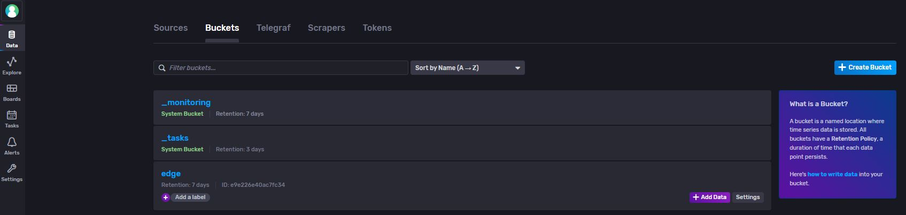
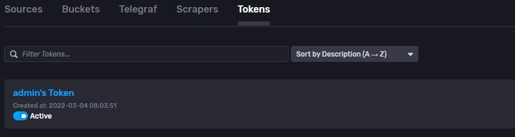
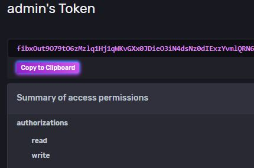
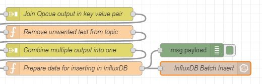
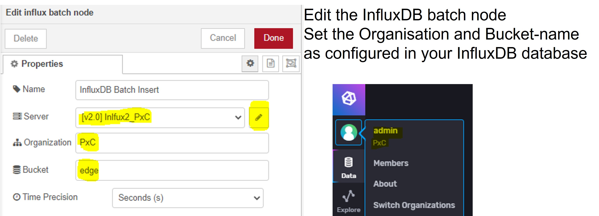
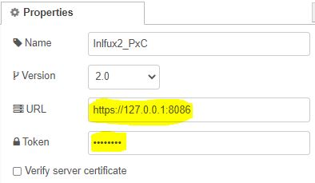
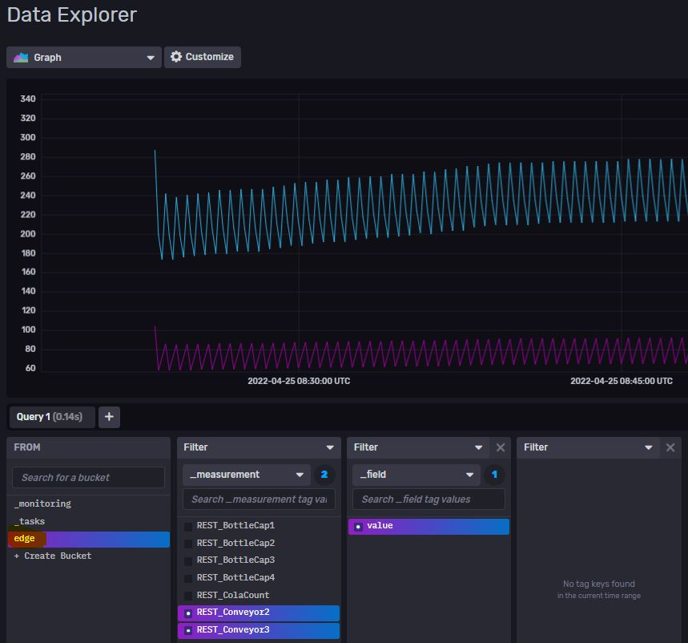

# Quick Reference Guide 

## InfluxDB 2.0 Chronograf Configuration

With FW 2022.0 - InfluxDB 2.0 Chronograf is pre-installed on your EPC

You have to set a username and passwort when first starting InfluxDB.  
Also, you have to set a "Organisation" name.  
In the below example, my username was set to "admin" and the organisation was set to "PxC".

## How to read data from the field from Node-RED
Our goal is, to read data from the field (via PLCnext Engineer or Node-RED) and then store those data in InfluxDB 2.0 to analyse and pre-process the data.  

1. First, go to "Data" --> "Buckets" and create a new bucket.  
The created bucket will be used to store all incoming data.  
Set a "Retention Policy" which defines how long the data should be stored.  
    >Attention, if you safe a lot of data into this bucket, configure the Retention Policy in a way that the storage of your EPC will not be written full.

     
     

2. To be able to write data from Node-RED to InfluxDB 2.0, you have to set a "Token".  
Eather create a new Token "+ Genearte Token" or use the default "admin's Token" in Node-RED.  
       
Copy the value of your Token.  
      

3. After you have collected data in Node-RED using any Protocoll (OPC UA, REST, Modbus, ...) your require (Can be found [here](../../EdgeFunctions/1_CollectingData.md)), the InfluxDB Node has to be configured.  
      
Edit the InfluxDB batch node. Set the Organisation and Bucket name as set in your InfluxDB database.  
      
Next, set the properties of the node (Pencil button on the right)  
Paste the "admin's Token" or any self-configured Token.  
      
Deploy your changes.  

4. As result, you should now be able to see the incoming data in InfluxDB. 
All data can be seen in the "Explore" tab.  
You can then create dashboards, alerts and scripts to downsample and analyse your data.
  
 

Please see next chapter: [Alerting with InfluxDB](InfluxDB_Alerts.md)

