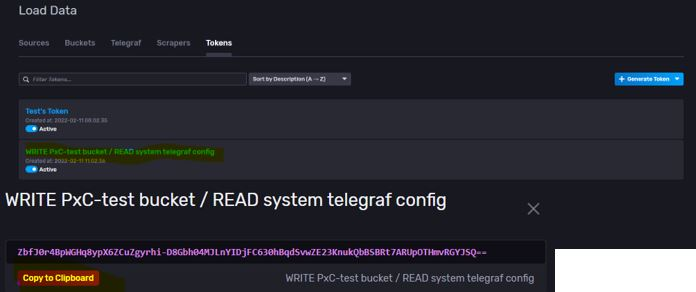
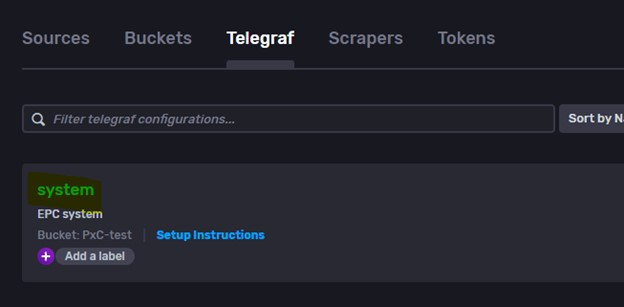
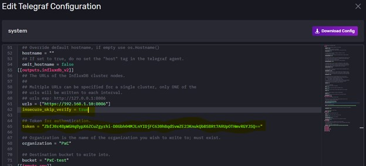
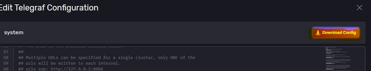
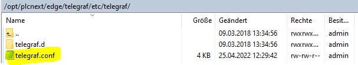
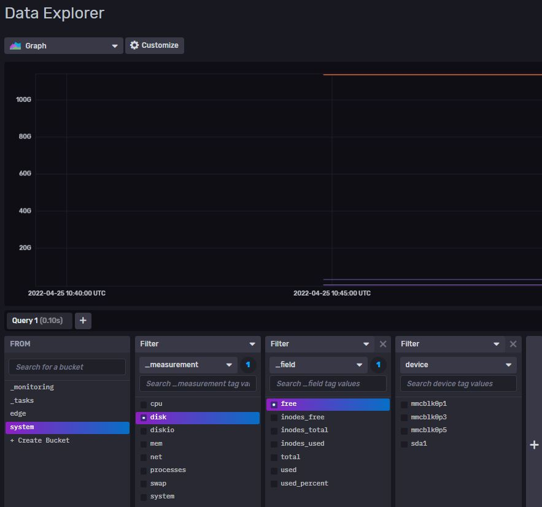
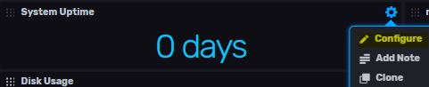
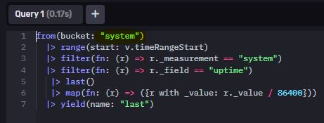

# Quick Reference Guide 

## InfluxDB 2.0 Telegraf Configuration

With FW 2022.0 - InfluxDB 2.0 Chronograf is pre-installed on your EPC

Telegraf is InfluxData’s data collection agent for collecting and reporting metrics. Its vast library of input plugins and “plug-and-play” architecture lets you quickly and easily collect metrics from many different sources.

In this example, Telegraf is configured to then track system measurements like CPU, disk and memory usage. 

1.	Navigate to Data – Bucket and create a new bucket "System"
2.  Navigate to Data – Telegraf
3.	Click on Create Configuration
4.	Make sure the Bucket "System" is selected in drop-down. 
5.	Select System and click continue
6.	Name the configuration and click Create and Verify
7.	Click “Finish”
8.	Copy your Telegraf token. You can find it under Data->Tokens  
  

9. Click on your Telegraf entry
  
10. Edit the telegraf configuration  
    a.	Add “insecure_skip_verify=true” under the “urls” setting if using a self-signed certificate  
    b.	Paste the token value into token = “[value of token]”  

    

11. Save the changes and press “download config”  
  

12. Open up the software "WinSCP" on your Host-PC.  
Navigate to the folder /opt/plcnext/edge/telegraf/etc/telegraf/  
and replace the contents of "telegraf.conf" with the config file you downloaded in the previous step.  
  

13. Reboot your EPC

14. As a result, you now should be able to track all available system-variables in your bucket "System".
  

15. You can use a pre-defined dashboard in InlfuxDB, called "System" with all a lot of relevant data already configured.  
    a.) Navigate to "Boards" and open up the "System" board.
    b.) You might have to set the name of your bucket (In my example "system" to each cell.)
      

      

16. After configuring each cell, you should have a good overview of your system values.   
  
 

Please see next chapter: [Send data into AnyCloud](../Cloud/InlfuxDB_to_AnyCloud.md)  
