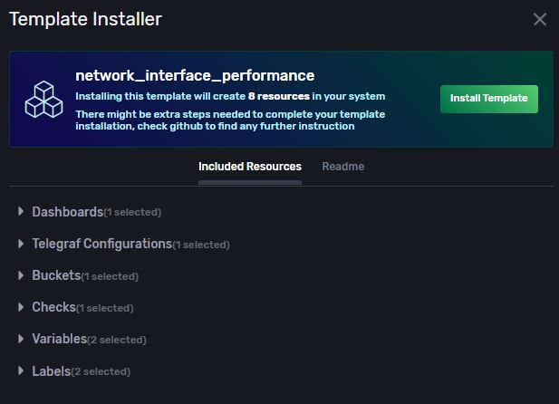
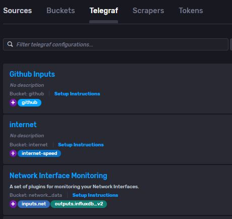
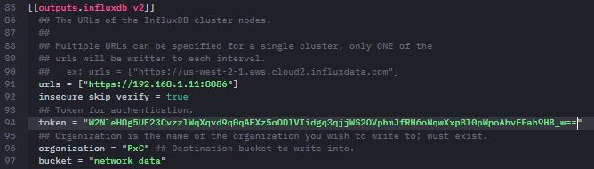
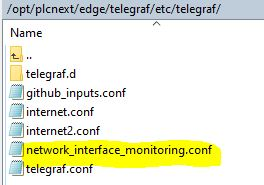
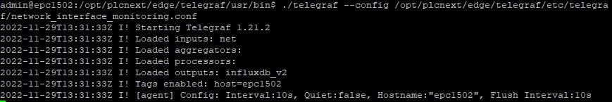
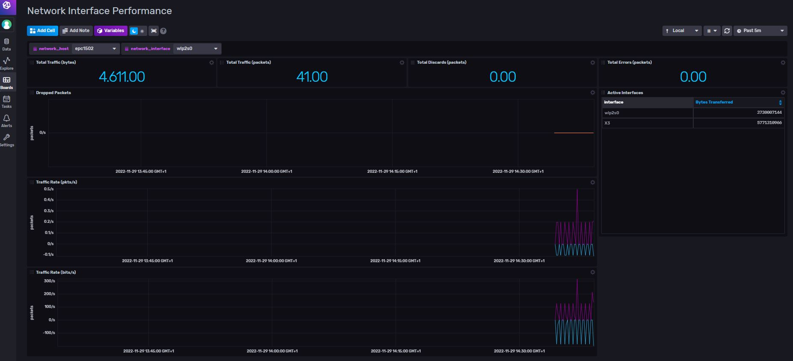

# Quick Reference Guide 

## InfluxDB 2.0 Templates

1. Naviagte to "Settings" --> "Templates".
2. Paste the URL of the Templates resouce. A list of predefined Templates can be find [here](https://github.com/influxdata/community-templates/). 
In this example, the ["Network-Interface-Performance"](https://github.com/influxdata/community-templates/tree/master/network_interface_performance) package will be installed. 
3. Paste the URL of the ["Network-Interface-Performance"](https://github.com/influxdata/community-templates/tree/master/network_interface_performance) and "Lookup for Templates". Install all the resources found from Github by "Install Template". <bt>
  
4. Next, navigate to "Data" --> "Telegraf" and open the new created "Network Interface Monitoring" Configuration the Template installed.  
  
5. Change all configuartion ("$") according to your system.  
  
6. Save the Configuration and download it via the button "Donload Config".  
Open up a new session with "WinSCP" and navigate to paste the folder into:   /opt/plcnext/edge/telegraf/etc/telegraf  
  

7. To start the Template for the first time, open up a new SSH Shell (PuTTy) and navigate to the folder:  

> cd /opt/plcnext/edge/telegraf/usr/bin  

Start the application with this command:  
> ./telegraf --config /opt/plcnext/edge/telegraf/etc/telegraf/network_interface_monitoring.conf  

  

Since the Template also installed a new Dasboard, check if the data is received by opening your InfluxDB instance on your EPC and naviagte to "Boards" --> "Network Interface Performance".  
In my example, since I am connected to the internet via WIFI, I can see the network traffic via my interace "wlp2s0" very easiliy in just some seconds after deploying the template!  

  