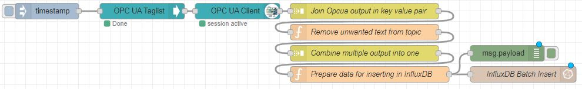
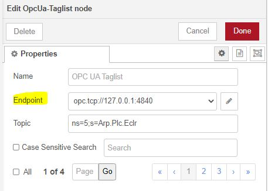
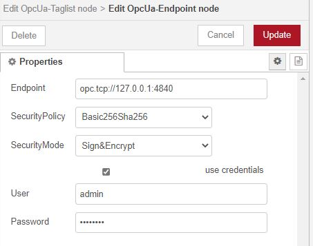
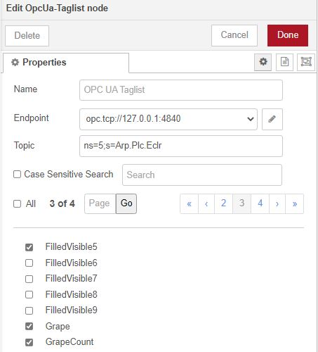
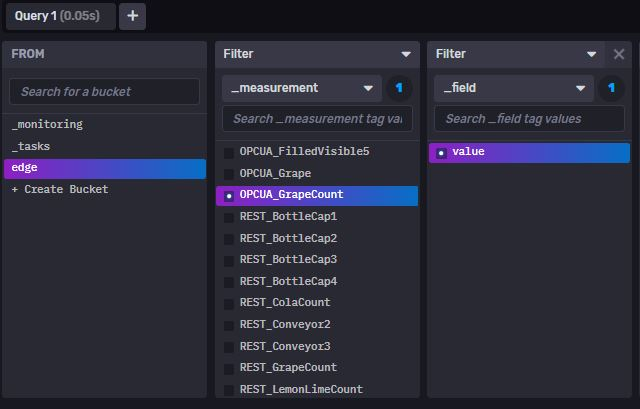

# Quick Reference Guide 

## Collect data via OPC UA from the field

> **SourceCode can be found [here](../Node-RED/OPCUA_Taglist_toInflux.json)**

The OPC UA Taglist Node is now preinstalled on your EPC.  
With the OPC UA Taglist Node, you can connect to any OPC UA Server and read huge amount of data (variables) with just one node.

## 1. Prepare the OPC UA Server
Make sure that the OPC UA Server supports OPC UA to be able to connect with the EPC-Client.

> Important! Make sure the time configured on the EPC (can be configured with PLCnext Engineer) matches the time configured on the OPC UA Server.  
If the time doesn't match, the certificates may be rejected from the Server.

## 2. Configure the OPC UA Tagnode
1. Import the [ExampleFlow](../Node-RED/OPCUA_Taglist_toInflux.json) 

2. Configure the OPC UA Tagnode.  
Set the "Endpoint" to the Serveradress. In the example below, the adress ("opc.tcp://127.0.0.1:4840) is the OPC UA Server of the EPC. 
Also, the "Topic" may change if you connect to a non-Phoenix Conatct device.   
  
Also, further extand the configuration (Pencil button) and set the required security setting.  

3. Configure the OPC UA Client node
Configure the "OPC UA Client" node and set the same "Endpoint" and "Topic" and Security settings.  

4. Configure the "InfluxDB Batch Insert" node. Set up your organisation and bucket-name as you have [configured it in InfluxDB](../Influx2/Influx_Configuration.md)  

## 3. Use the OPC UA Tagnode 
1. If all configurations are done correctly, deploy your changes.  
The OPC UA Taglist should show the status "Done", the OPC UA Client should show the status "session active".
2. If the OPC UA Client successfully connected to the OPC UA Server, the OPC UA Tagnode should now list all available OPC UA variables found on the server.   Select all required variables in the list, accept by clicking "Done".  
.  
3. In my example, 10 variables are read. Since those 10 variables should be written into InfluxDB in an Array, the node "Combine multiple output into one" has to be set to 10 messages:  
  

4. The data will now be written into the local InfluxDB database.
With this method, a hige amount of data (huge amount of variables) can be read into the local database with minimal effort and with the exact same flow that is as small as shown above.  
I can now analyse and pre-process the data in InfluxDB Chronograf.  

> Troubleshoot: If your OPC UA Client node can not connect to your OPC UA server "rejected by OPC UA Server" please check the configured time (in WBM or similar) of the client and server. The time of both have to be somewhat the same, otherwiese the certificates both exchange to each other is invalid!  
You can also change the configured time of the EPC using PLCnext Engineer. 