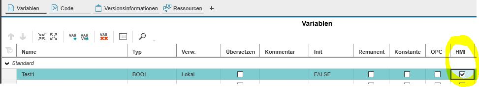
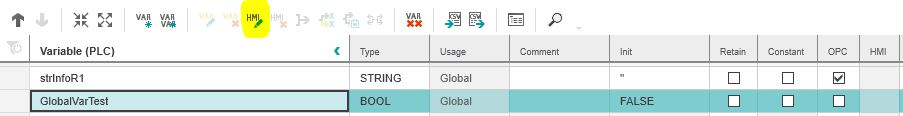
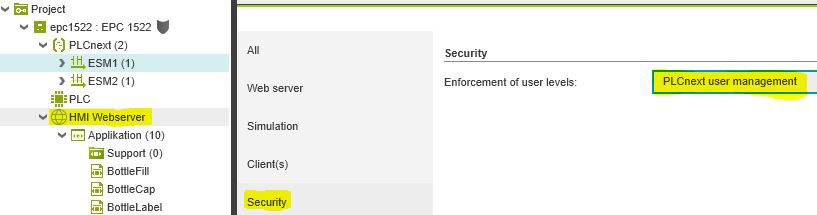
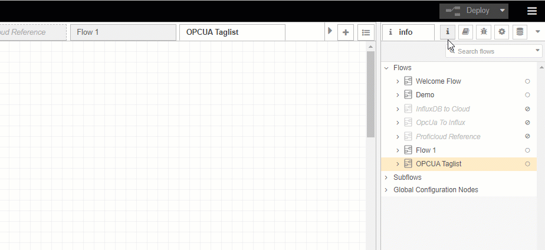
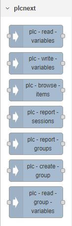
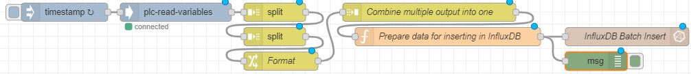
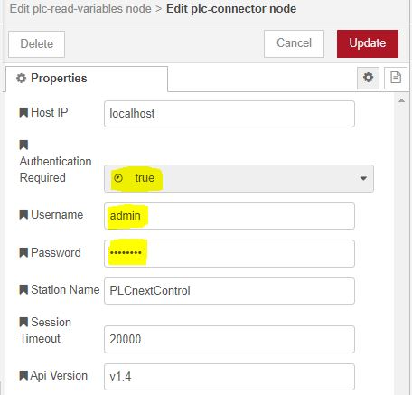
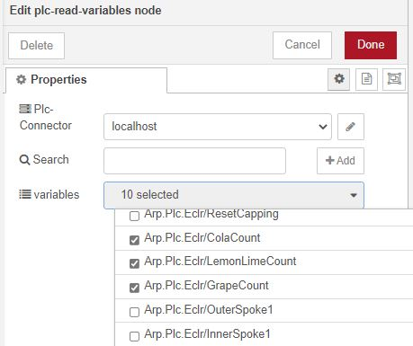
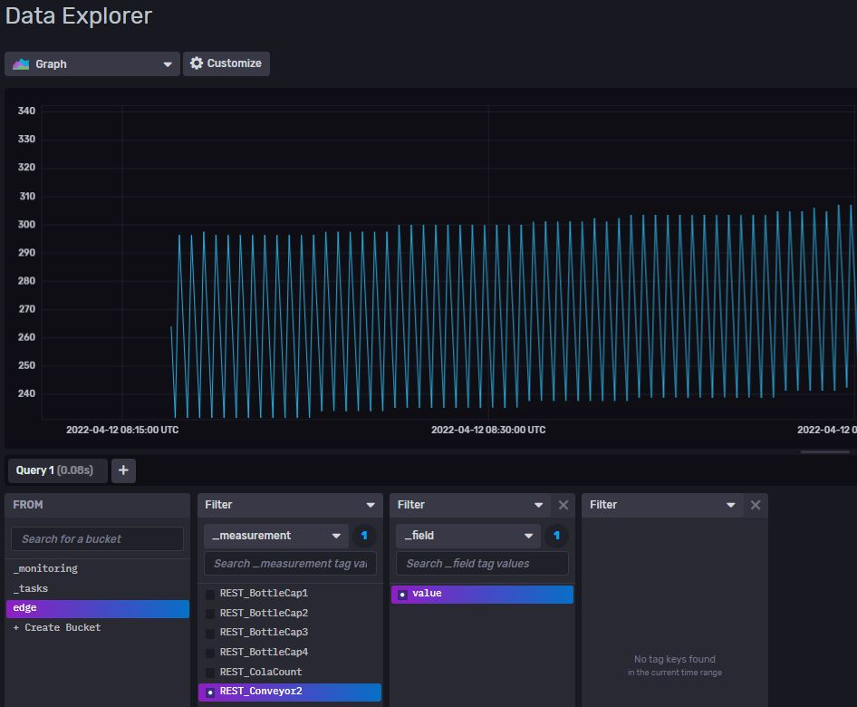

# Quick Reference Guide 

## Collect data via REST from PLCnext

> **SourceCode can be found [here](../Node-RED/REST_Demo_to_Influx.json)**

The easiest way to collect data from any PLCnext device is via the REST protocol. 
That includes data that is generated on the "OT" side of your EPC (PLCnext Engineer) or also any PLCnext device in the field.

> Since the REST nodes are not pre-installed on your EPC, a internet connection is required to install those nodes.

## 1. Prepare the PLCnext data of the Field-device
In the PLCnext Engineer project all GDS ports or PLC variables can be accessed 
with the REST interface when the "HMI" flag is approved.

The "HMI" flag of each variable that should be read by Node-RED of the EPC has to be set.

For **local** Variables, simply set the "HMI" flag in the program:  
  

For **global** Variables, you have to right-click on the variable and confirm "create HMI tag" or select the variable and click on the "HMI" tab symbol above.  
  

Also, if you want to create a secured connection (User authetification), you must enable the "PLCnext user management":  
  

> Deeper information about REST can be found   
 [here](https://www.plcnext.help/te/Service_Components/REST_data_interface/REST_data_interface_Introduction.htm)  

## 2. Install the REST nodes from the Node-RED Palette-Manager 
Install the package "@kjgalr/node-red-plc-next-connector" from the palette manager  
  

The package will install new nodes to your Node-RED:  

  

## 3. Use the nodes to read data into InfluxDB
1. Please import the [ExampleFLow](../Node-RED/REST_Demo_to_Influx.json) 
 We will focus on the "read-node" to read data from any PLCnext device into the local InfluxDB database of the EPC.  
  
2. Configure the "InfluxDB Batch Insert" node. Set up your organisation and bucket-name as you have [configured it in InfluxDB](../Influx2/Influx_Configuration.md)  
3. Configure the "plc-read-variables" node. All it needs, is to set the username and passwort (printed).  
If you want to read data from the PLCnext of the EPC itself, connect to the Host-IP "localhost" as shown in the image below.   
If you want to read data from a PLCnext device in the field, set the ip-adress of the device as Host-IP and set the username/passwort of the device.  
  
After doing so, deploy the flow.
4. After a first deployment, the "plc-red-variables" node should show a "connected" status.  
Open up the "plc-read-node" again and set any variable you want to read. You can use the search-bar to set any variable or open up the drop-down menu and set multiple variables to read.  
  
In my example, 10 variables are read. Since those 10 variables should be written into InfluxDB in an Array, the node "Combine multiple output into one" has to be set to 10 messages:  
  
5. The data will now be written into the local InfluxDB database.
With this method, a hige amount of data (huge amount of variables) can be read into the local database with minimal effort and with the exact same flow that is as small as shown above.  
I can now analyse and pre-process the data in InfluxDB Chronograf.  
  