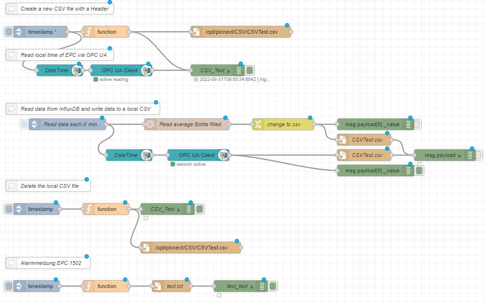
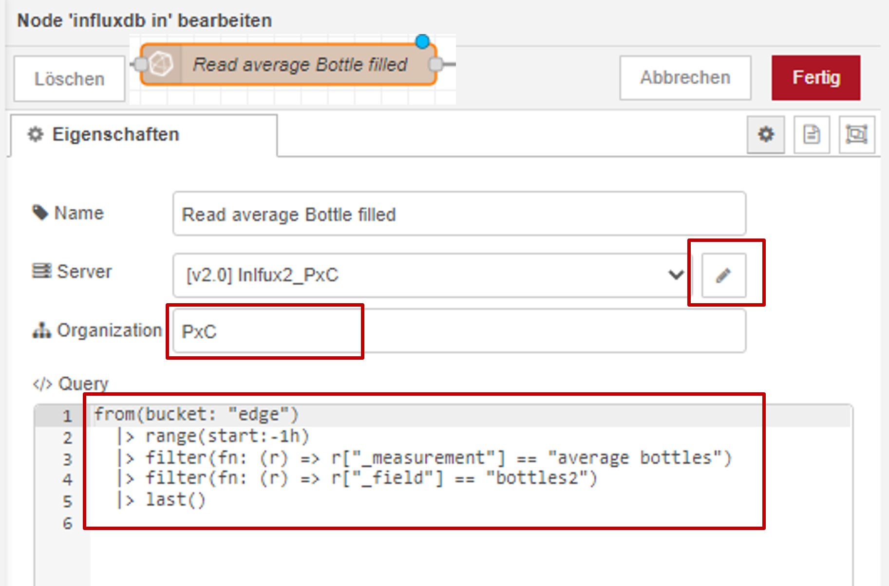
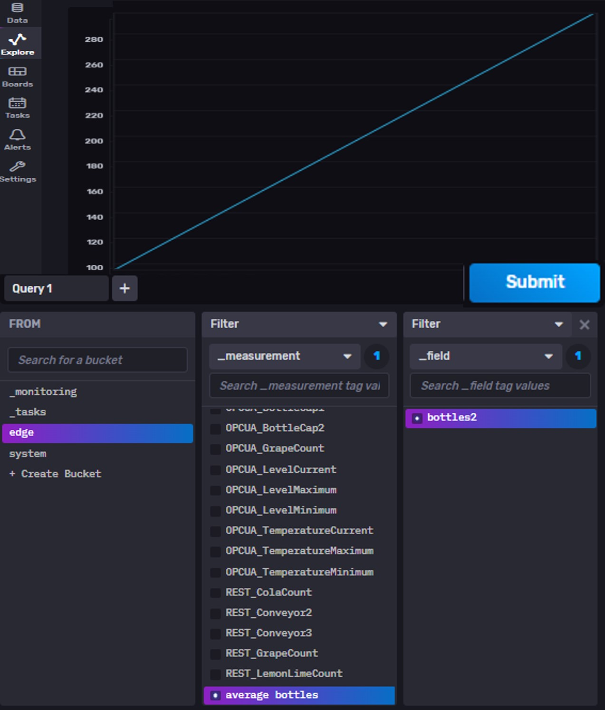
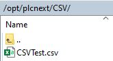
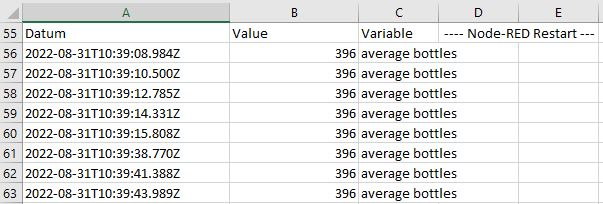

# Quick Reference Guide 

## Export data from InfluxDB to Node-RED and write the value to a CSV-File

> **SourceCode can be found [here](../Node-RED/Influx_to_CSV.json)**

After you stored you data local in InfluxDB, might compromised it via a "Task" or analysed the data with an Alerting algorism, you can export this data back to Node-RED again.  
This data can be visualised in Node-RED or further analysed via function nodes.  

In this example, I am exporting a variable from InfluxDB to Node-RED in order to write the data into a local CSV file each X hours.  
That CSV file (for example with alerts) I will then send via e-mail in the next step.  

  

1. Import the [attached flow](../Node-RED/Influx_to_CSV.json)  
2. Make sure, the OPC UA Client nodes, which reads the local time of the EPC are configured correctly.
3. Configure the "InfluxDB IN" node. In this example, the node is called "Read average Bottle filled".  
To do so, first configure the node itself with your configurations and credentials via the "Pencil button".  
Inside the query, you need to address the variable beeing polled form InfluxDB.  
  
To set the query for your variable, just open InfluxDB and visualise your data in the "Explore" tab.  
  
After selecting a variable that you would like to export to Node-RED to write it's value into the CSV file, instead of just visualising the value as a graph, switch to the "Script Editor" next to the "Submit" button.  
  
That way, you will see the required information of the variable for Node-RED. Extract those information from InfluxDB to the Node-RED node.  
  

4. Deploy the flow and press the inject node "Read data each X min".  
The variable should now be read and written into the csv-file "CSVTest.csv" inside the local folder /opt/plcnext/CSV/ (the path can be changed of course).  
You can test so by connected "WinSCP" to your EPC.  
  
  

Are you further interested? - We can expand this function by a small flow that will send this csv-file via e-mail!  
That way, alerts could be exported each day for a daily repot to the techician.  
The flow to do so, can be found [here]