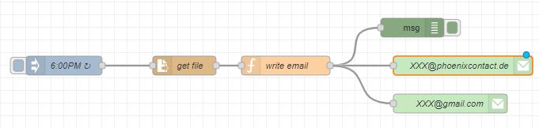
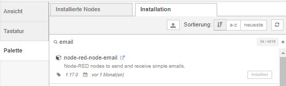

# Quick Reference Guide 

## Send a daily report (csv-file) via E-Mail

> **SourceCode can be found [here](../Node-RED/DailyReport_via_Mail.json)**

In chapter [Read data from InfluxDB and write its value into a CSV-File](/FW_2022/Code/Node-RED_Examples/3_Read_Data_from_InfluxDB_to_CSV.md) a CSV-File was created and stored with variables.  
In this step, this CSV-File should be send via a SMTP server to an e-mail adress of a technician for a daily report.  

  

1. In oder to use the e-mail nodes needed, you need to install the "node-red-node-email" package from the Palette Manager. 
  

2. Import the [attached flow](../Node-RED/DailyReport_via_Mail.json)  

3. Select what file should be attached to your email via the "get file" node.  
In my example the CSV-File created before "CSVTest.csv" inside the folder /opt/plcnext/CSV/ will be attached.  
You can change the function node "write email" accordingly to your required text.  
4. The sending mail-address needs to be logged in (via password).  
Set your username and passwort.   The receiver just needs a mail-address  