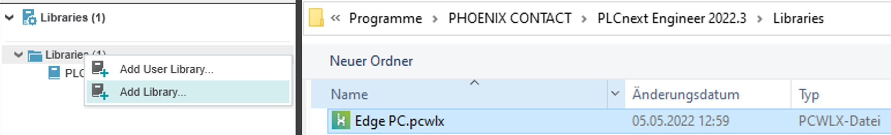
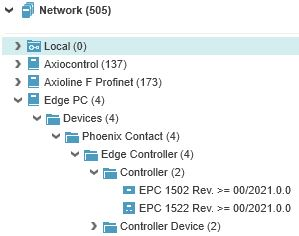
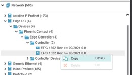
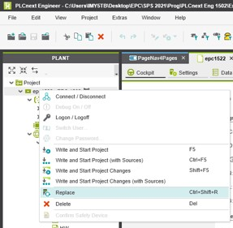

# Quick Reference Guide 

## Programm an IEC61131 Programm (OT) with PLCnext Engineer
 

> If you are new to PLCnext Engineer programming, please refer to https://elearning.plcnext.help/PLCnEng_Basics/story_html5.html to develop your PLC program.

PLCnext Engineer can be installed [here](https://www.phoenixcontact.com/de-de/produkte/programmier-software-plcnext-engineer-1046008).  

The EPC 1502 and EPC 1522 can be programmed via PLCnext Engineer. Control application can be developed, but also data can be collected through the variety of protocols.

## Import the Library to PLCnext Engineer
To be able to use your EPC with PLCnext Engineer, you fist must import the "Edge PC" library.  
  

After importing the library, you should see a new folder in "Network" called "Edge PC".   
  

Select the right device and firmware-version and import the Controller to your application.

> If you want to use your EPC as Profinet Controller or Device, make sure ETH-Port "X3 - LAN1" is used, as the other ports have no Profinet capability! 

If you are used to any PLCnext Controller, you will have no issue using the EPC, as it functions the same.  
Just remember that no retain handling is supported. The EPC only stores retentive data cyclically and does not save the value of the variable in the event of a voltage loss.  
Also important is that the realtime behaviour can be influenced by Node-RED, InfluxDB or Docker.  

## I have an existant PLCnext Project, how do I change the PLC to an EPC?

With PLCnext Engineer, the controller can also be exchanged in an existing project at any time.  
To do so, first select and copy your EPC from the right side "Network".  
  

Afterwards, right click on your existing controller on the left side and click "replace".  
  

If you require any other help, please refer to https://elearning.plcnext.help/PLCnEng_Basics/story_html5.html  