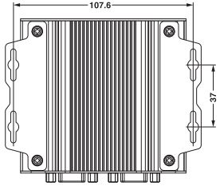
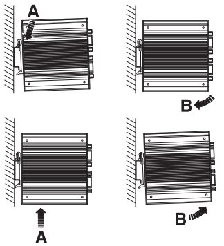
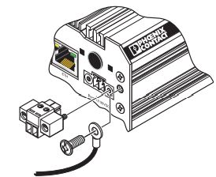

# Quick Reference Guide 

## Installation
 
### What is new with FW 2022.0?

A lot of very exciting thing got into the new Firmware!
First of all, the Edge-Cockpit featuring all Edge-Functions nis now build into 192.168.1.10/wbm. (The /cockpit is no longer available and needed)  
Finally you are able to use the WIFI card to establish a wireless internet-connection, and display the configuration and smaller visualisation directly and local via the DisplayPort!  
Next to the Update of PLCnext to version 2022, we also updated all pre-installed Open-Source Software.  
We made sure, that collecting data from the field is now as easy as never. - With new self-developed nodes you can collect a huge number of data with just one node! Since there is a huge amount of new functions, this Github forum is build completely new - feel free to read through and ask any question.
 
 

# 
## Datasheet
A datasheet can be found on the official Phoenix Contact homepage:  
[Link to EPC 15x2 datasheet](https://www.phoenixcontact.com/online/portal/de/pxc/product_detail_page/!ut/p/z1/5VddU6MwFP0r-tDHNAnffSyUarUq1VoLL0wIocsuECyxVX-9ie2OY0fb2XH6sjAZSODec3PuzWHmwgjOYVSRVb4gIucVKeQ6jKx46k59P9AsfDMxXTQamJ4_Nm5794EGZzCCUcMKRgVLPSLYgi9fYNgfj9UHQRIYmmpWU_oHhgHQMMAGQFi9K_JkSZR1ylL2bpSnMMTYMQ1sqTXPAs-73HUTuSgYDF3-DALvBJz48o5NpMnpX9-HvdtWMPtZbfzRN1cfHfIPpb8dO9qld35m4CuEAxNNXC-YzKY3Xv8awTtFJK8aQSrKFOsv8_GRviWTZiu23BjWS54-UTFgguRFMxKsHH1O3LcF2c1wnWYll8E2sLzJVd0_BZHrKXsW23dfVFFCFKRaPJGFgjnAXGstc9xa5npbmQ9bq_Nha3U-bK3Oh63V-ay1Op-1Vuez9p72tv7hJshoLXNLMg9dGD4ISx-t4YVMQlJ217Tsom79TLvboHH6Ti2uFajsHfPfj49RH0aUV0JtZq4y1EFrlnRQSfKqg7aOTQcVeSPeHeU8GHuVtI8Fo78qXvDFS0x5WfOKVaKJP3h0UGbbGWIJAhqxETAQ1YFj2T1gp5lmmIhpVprIdi7a27FtErK_47tLWTzw42DuDfwDCpna8GGVszW8r_iylF303aYGqoamlemIIh0gkhFgJBYFiZVpQM9sRrCDk57mwHN0IIJu_DDCAXjrqPAXx4V3j5sc1zwq_O1Pd3-x96hPjJ_osi7oHl3W_6rLuiwdfTvA_fx1ypLXz8NB-ofJZsTX1-ZqZ_wHnvGV6I3AmZc4V75uLsp459H0T0_fALRgvXA!/)  
The datasheet is valid for both devices.

## Set up your hardware
Choose the desired mounting method and follow the appropriate 
procedure.

### Wall mount
Order No. [1147655](https://www.phoenixcontact.com/product/1147655)  
The EPC 15x2 can be attached to a flat surface in a wall-mount orientation using the four key holes. The mounting surface must be flat and 
not subject to vibration.
>NOTE:
The EPC 15x2 must be installed with the connectors oriented 
down to allow the convection cooling to function efficiently  

 Installation:
 1.  Attach the two brackets to the EPC... using the included M3x5 
screws.Torque the screws to 0.5 Nm.
2.  Use the EPC 15x2 as a template and mark the locations of the 
mounting holes on the mounting surface.
3. Use the correct anchor type for the mounting surface and securely attach the EPC 15x2 to the wall. Ensure the attaching hardware is in the small section of the mounting holes.  

### DIN rail mount
Order No. [1147464](https://www.phoenixcontact.com/product/1147464)  
1. Install the mounting bracket on the EPC... with the included 
M3x5 screws so the connectors will be oriented downward after 
installation. Torque the screws to 0.5 Nm
2. Angle the EPC 15x2 so the top edge of the mounting plate hangs on 
the top edge of the DIN rail.
3. Rotate the EPC 15x2 down against the lower edge of the DIN rail. 
Press in until the latch snaps closed.
4. Secure the device on the rail with clamps.
5. If necessary to remove, release the latch using a screwdriver, rotate the bottom of the EPC away, and then lift it straight up off 
the DIN rail  

### Connecting the power supply
A removable plug (Order No. [1847055](https://www.phoenixcontact.com/product/1847055) on the EPC 15x2 accepts 
wire sizes of 0.2 ... 2.5 mm² (12 ... 24 AWG).
> NOTE:
To ensure safe operation, use safety extra-low voltage 
(SELV) according to DIN EN 61131 as supply voltage.
This device is protection class I item of equipment.

1. Connect the power conductors to the appropriate terminal in the 
connector.
2. Connect the ground/earth to the screw (5).
3. Insert the connector into the IPC.  

 
 
Now that your EPC is installed and ready to use, see the next chapter: [Edge Cockpit](1_EdgeCockpit.md).  
 
If you are still using Firmware 2021.0, please see [how to update to FW 2022.0](2_FirmwareUpdate.md). 