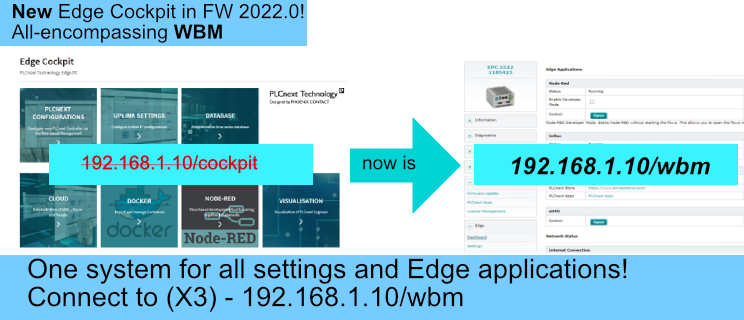

# Quick Reference Guide 

## Using the Edge Cockpit
 

With FW 2022.0, the Edge Cockpit is now integrated into the Web Based Management (WBM).
The WBM includes the entire settings for network, security and with the Edge-PCs, now also the "Entrance" for all Edge functionalities such as Node-RED, InfluxDB and Docker.  

  

Open the Edge Cockpit via your Host-PC using a Webbrowser and connect to  
ip-address/wbm    (default X1: 192.168.1.10/wbm)

The WBM systems of controllers with PLCnext Technology all have the same structure and are generally described in the [following](https://www.plcnext.help/te/WBM/WBM.htm). 

Device-specific additions and deviations are described in this forum:  
  

In the Edge "Dashboard" tab, you find hotkeys to directly open-up Node-RED, Influx-DB Chronograf and PLCnext Visualisation eHMI, as well as Docker-Portainer (in case you have installed the App, guidance to install can be found here).

In the "Settings" tab, you find further hardware specific configuration.
You can disable the USB ports, which are used to interact with the DisplayPort-Output. It is recommended to disable the USB-Ports if you don't use the DisplayPort.
Also, since the Edge-PC is the first PLCnext device featuring a wireless WIFI connection, you will find the configuration to connect to a router, which is [described here](HW02/Network_Configuration.md).  
 
See next chapter: [Set up your Network Configurations](3_Network_Configuration.md).  
