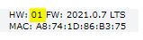
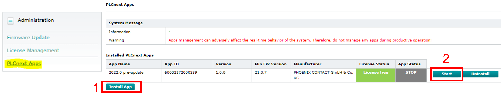
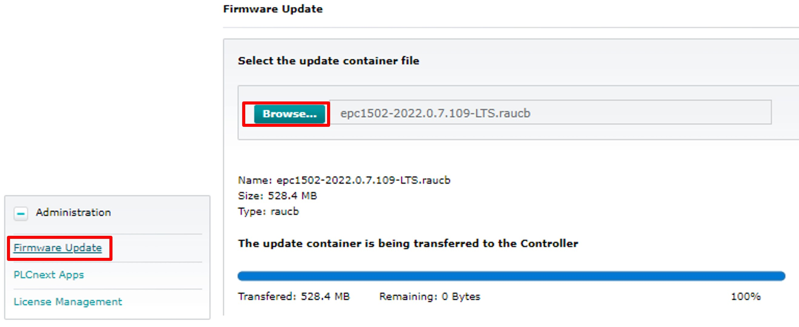

# Quick Reference Guide 

## Firmware Update from FW 2021.0.7 to FW 2022.0
 
>Attention! The Update to FW 2022.0 can only be done with >HW01 devices!

To be able to explore all new features of the FW 2022.0, you might have to update your EPC before.  

Due to the large amount of changes and improvements made by the firmware update, a little manual pre-preparations are needed beforehand.  

The update is larger than any other update file of a PLCnext Controller, which is why you must change the max. UpdateFile-size currently configured in the controller.  
This is very easy to do, just install the App "HIER REINSETZEN LINK APP!!!!" in WBM.

1. Initial situation: Connect to the WBM (default: X1 - 192.168.1.10)  
Make sure your device has a hardware revision of at least HW01.  
  

2. Download the "PreUpdate App" from the [PLCnext Store].
   Download the "UpdateFile.raucb" from the Phoenix Contact Homepage:   [EPC 1502 Update File](https://www.phoenixcontact.com/de-de/produkte/box-pc-epc-1502-1185416) or [EPC 1522 Update File](https://www.phoenixcontact.com/1185423)

3. Install the App "PreUpdate 2022" via the WBM. Select the rauc.b Update-File and press "Start".  
Your EPC will reboot and and sets the necessary changes for the update.  
  

4. Reconnect to the WBM again and open up "Administration" --> "Firmware Update"  
Browse the previous downloaded (.raucb) Firmware-file and press "Start".  
  
Once the EPC is done installing, reconnect to the WBM and check if FW 2022.0 is now installed.  

> Do not shut-off the power while the EPC is updating! The EPC will restart automatically.

> Attention, your data currently stored in InfluxDB 1.8 will be lost after the Update to InfluxDB 2.0!

   
    
    
Please see next chapter: [Edge Cockpit](3_EdgeCockpit.md)  