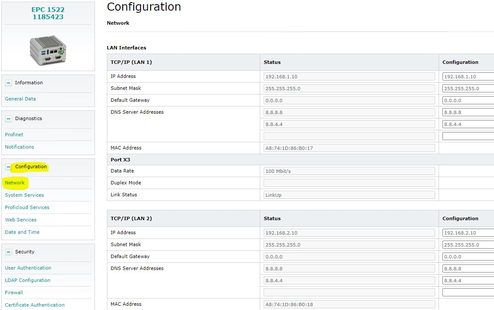
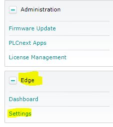
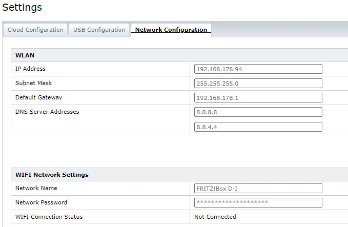

# Quick Reference Guide 

## Network and WIFI Configuration
 
To configure your device, connect your Host-PC with X3 (LAN1) of the EPC and connect to the Web Based Management (WBM) via ip-address/wbm  
> default: 192.168.1.10/wbm  

## Network Configuration

Your EPC comes with three network interfaces:  
> X3 (LAN1) - Profinet Controller  - Default 192.168.1.10  
> X2 (LAN2) - Generic Ethernet-Port - Default 192.168.2.10  
WIFI        - Generic WIFI wireless connection to your router - Default 192.168.3.10 

## Configure X3 LAN1 and X2 LAN2

To configure each port, switch to the "Configuration" tab in WBM and choose "Network"  
  

## Configure WIFI/WLAN - wireless connection to your router
Make sure the antenna is installed on your EPC.
To configure the WIFI, switch to the "Edge" tab in WBM and choose "Settings"  
  
Switch to "Network Configuration".  
Since the EPC does not support DHCP yet, we have to set the IP-address of the WIFI ourself.  . Therefore you need to know your IP network address area.  

In the example shown below (network address area 192.168.178.x), I set the IP address to 192.168.178.94 and set the default gateway to the IP address of the router.  
You also have to to set the name of your WIFI and also the password of your WIFI.  
  
If your configuration is correct, the status should change to "connected" after a reboot.

If you have set all configurations, you can switch to the next chapter: [Using the Edge Cockpit]

 
 

Please see next chapter: [Using the DisplayPort](4_DisplayPort.md).   

