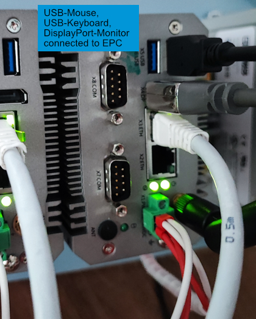
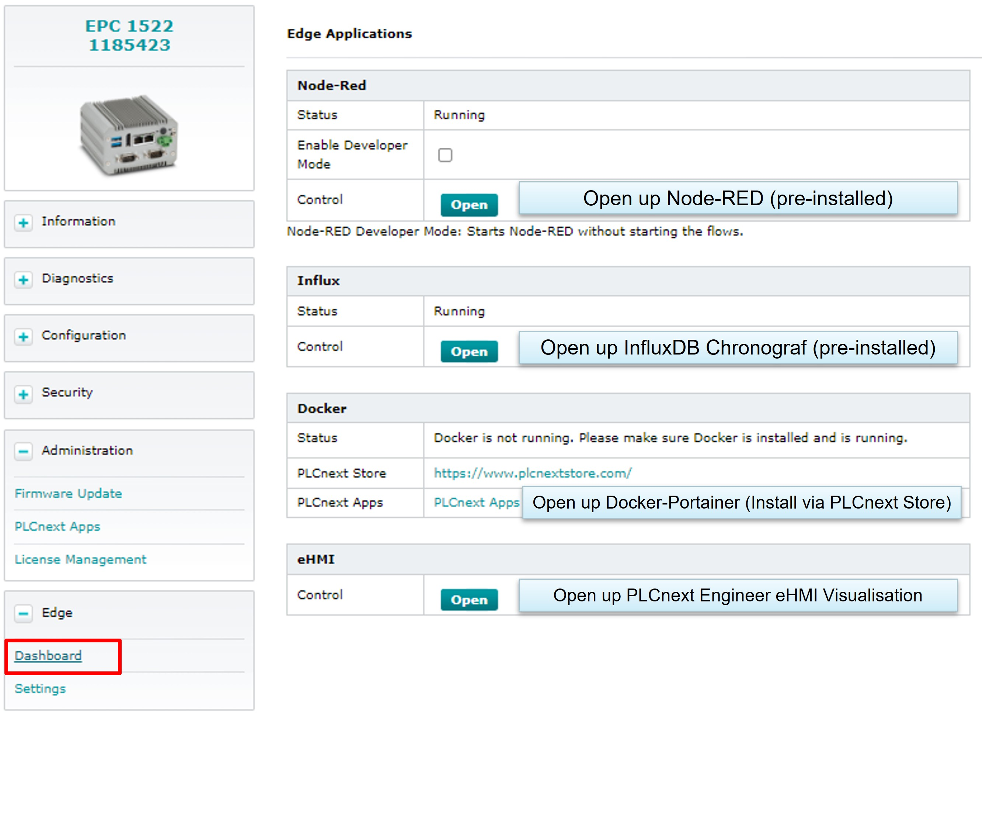
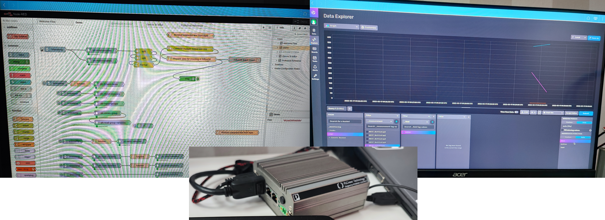

# Quick Reference Guide 

## Using the Display Port for local administration and visualisation
 
Another new feature of the FW 2022.0 is the support of the Display Port.  
The DisplayPort now outputs a Web-Browser which output the Web Based Management and therefore the Edge Cockpit.  
Node-RED and InfluxDB as well as the PLCnext Engineer HMI can be shown on a local DisplayPort-Monitor.

1. Connect a local DisplayPort Monitor to your EPC and reboot the device. 
>Attention! - The DisplayPort is not auto-scaled. If you connect a DisplayPort while the EPC in powered on, the image might not be scaled right or is not shown at all.  
To prevent that, install the DisplayPort while the EPC is powered off or reboot the EPC after installation of the Monitor.

2. Since the WBM will be shown, you need to sign in using your credentials (default "admin" and password printed on the device).
To do so, you need to install a mouse and a keyboard via the USB-ports of your EPC.

3. Start up your EPC and log into the WBM using your credentials. 
Navigate to "Edge" to open up eHMI, Node-RED or InfluxDB Chronograf.

>Attention! - Outputting the visualisation, especially with many graphics or animations (Node-RED, partly in Chronogaf) can be very resource-intensive. A permanent output of a visualisation is not recommended. 

Output on DisplayPort-Monitor:
Select "Edge" --> "Dashbaord" and open any function (Node-RED, InflxuDB Chronograf, PLCnext Engineer Visualisation "ehmi" or Docker-Portainer)

Example output on DisplayPort-Monitor:

You can change the tab or go back into the WBM via the buttons on the upper right:  

To interact with with your DispalyPort-Output, you have to install a USB-mouse and a USB-keyboard, further information can be found [here](5_USB.md).