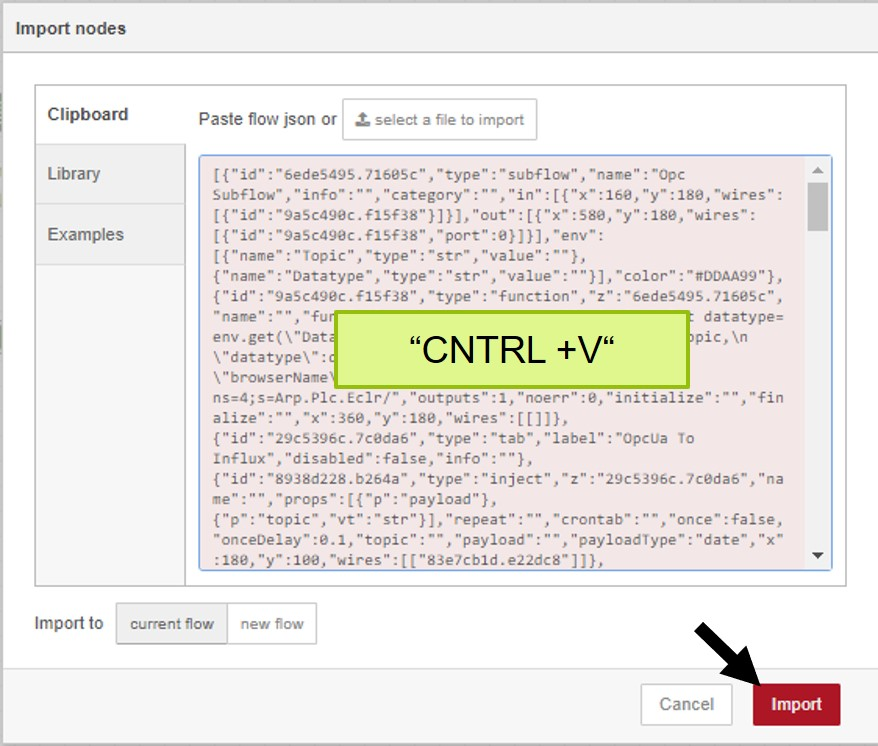

# Quick Reference Guide 

## Collecting data via Node-RED to store it in InfluxDB
 
The main goal of the EPC is to collect data from the field, analyse the data locally to then send the processed data into any cloud or server.

The examples below will help you to collect data from the field.  
By using own-developed nodes for OPC UA and PLCnext REST you can now collect a huge amount of data as easy as never!  

**Please select the Protocoll you require, a detailed explaination with Source Code will then open** 

|  #  |  Protocol to collect data   |  Content   |   
| --- | --- | --- | 
| 1 | [OPC UA](../Code/Node-RED_Examples/1_OPCUA_Demo.md) | **NEW!** Collect a huge amount of data with just one "OPC UA Tagnode"   Variables from any OPC UA Server can simply be selected from a Drop-Down menu and written into InfluxDB to safe them locally.  |
| 2 | [PLCnext REST](../Code/Node-RED_Examples/2_REST_Demo.md) | **NEW!** Best solution if you collect data from any PLCnext Controller in the field!   Collect a huge amount of data from the PLCnext side of the EPC itself or from multiple PLCnext PLCs in the field.   Variables from any PLCnext device can simply be selected from a Drop-Down menu and written into InfluxDB to safe them locally.  |
| | |
| 3 | [Modbus RTU](../../FW_2021_ARCHIVE/02_ModbusToInfluxDB.md) | Collect data from Modbus Serial Devices (4-wire to 4-wire RS-485 withou Auto-RTS-Toggle limited)   EPC 1522 required  |
| 4 |[Basic Nodes](../../FW_2021_ARCHIVE/01_BasicFlow.md)|Learn Node-RED within the Edge PC with basic node functions. Common and function nodes like "Inject","Debug","Switch" nodes are described.|

## Import Example-flows into Node-RED of your EPC 1502/1522
1. Open-up and copy the source code (just the long string) of any example-flow (CNTRL + C)  

2. 
 Connect to your Edge-PC via Ethernet and open the Edge-Cockpit.  
    Default: http://192.168.2.10/wbm 

3. 
 Open Node-RED 

4. Click on the "Import" button on the right upper corner.  
 

5. Paste the string to the "Clipboard" and import the flow  
 

Please see next chapter: [Configre the internal Database](/FW_2022/Code/Influx2/Influx_Configuration.md)