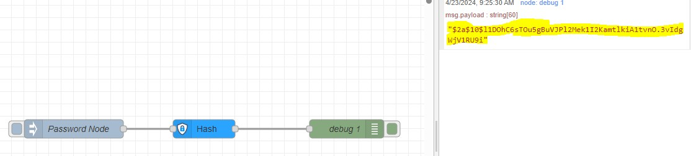
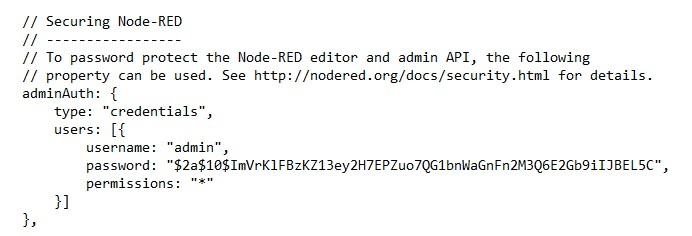
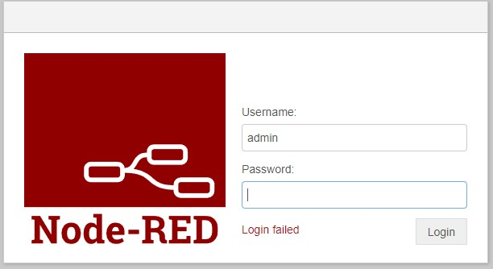
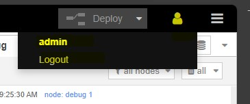

### Quick Reference Guide 
 

## Password potect your Node-RED App (any version) 
 

By default, your Node-RED App from the PLCnext Store is not secured - anyone who can access its IP address and port can access the editor and deploy changes.  

This is only suitable if you are running on a trusted network.  

To password protect the App follow the below steps:

1. Connect your EPC to the internet. To do so, please follow this chapter: [Connect EPC to internet](/FW_2023/Configuration/02_Network.md).  
2. Install the "node-red-contrib-bcrypt" node using the palette manager.  
3. Import the [Password_hash.json](/FW_2023/Node-RED/Examples/010_Password_hash.json) flow.  
4. Update the payload "Password Node" with the password.  
5. Deploy and start the flow. Inject the payload. The hashed value will be in the debug window.  
  
6. Update "/opt/plcnext/appshome/data/60002172000678/volumes/node-red/settings.js" with the hashed password above. Make sure to uncomment the setting:  
  
7. Reboot your device.  
8. Open up your Node-RED editor on your EPC again. You should now see a login required.  
  
8. You can logout by selecting the "preson" icon in the upper right window.  
  